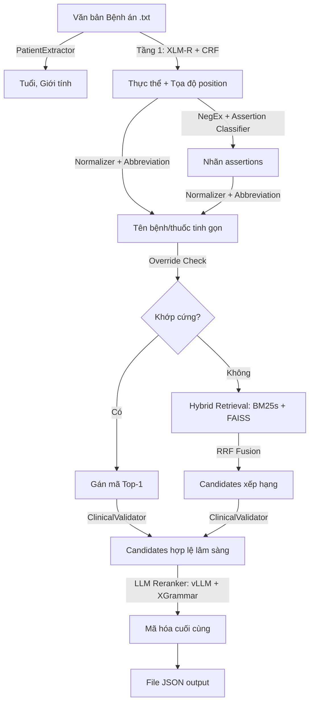

# KẾ HOẠCH TRIỂN KHAI — AI Race 2026, Bài 2
## Ontological Reasoning in Medical Knowledge Retrieval

---

## 0. Các quyết định đã chốt

> [!IMPORTANT]
> Mọi thiết kế bên dưới đều dựa trên các quyết định này. Nếu thay đổi, phải rà soát lại toàn bộ phần liên quan.

1. **Phạm vi = Vòng 1 (Sơ loại).** Tập trung 100% cho 15 ngày còn lại (15/07 → 30/07). Kiến trúc module hóa rõ ràng để sau này bọc API nếu vào Vòng 2.
2. **Giới hạn 9B tham số áp dụng cho TỪNG model riêng lẻ**, không cộng dồn. NER model (~560M), embedding model, LLM reranker (~7-8B) — mỗi cái ≤ 9B.
3. **Reproducibility là yêu cầu hạng nhất** — containerize sớm để phát hiện bug môi trường, không dồn cuối.
4. **Chống rò rỉ dữ liệu:** Tuyệt đối không dùng tệp `input/` của BTC làm dev/train. Tập dev cục bộ trích từ dữ liệu tự sinh.
5. **Quản lý dữ liệu tập trung** tại `data/` phục vụ Docker và đồng bộ.
6. **ClinicalValidator hoạt động fail-safe:** Quét 150 ký tự đầu, hủy nếu gặp từ khóa nhiễu (người thân, nhân viên y tế), trả `None` → giữ nguyên candidates gốc.
7. **5 lượt nộp/ngày** — mỗi lượt phải cực kỳ chất lượng.
8. **Nhật ký thực nghiệm** ([experiment_log.md](file:///d:/AI%20Race%20Viettel/docs/experiment_log.md)) bắt buộc cập nhật sau mỗi lượt nộp.

---

## 1. Kiến trúc Hệ thống

### 1.1. Tổng quan Pipeline



### 1.2. Stack kỹ thuật chính

| Tầng | Công nghệ | Vai trò |
|:---|:---|:---|
| **NER & Assertion** | XLM-RoBERTa-large + CRF + NegEx rule-based + Deep Assertion Classifier | Trích xuất 5 loại thực thể + phân tích thuộc tính lâm sàng |
| **Retrieval** | BM25s (lexical) + FAISS IndexFlatIP (semantic, BGE-M3 embedding) + RRF Fusion | Tìm kiếm ứng viên mã ICD-10/RxNorm |
| **Reranker & Format** | Qwen2.5-7B-Instruct (vLLM) + XGrammar Constrained Decoding | Xếp hạng cuối + ép JSON schema |
| **Validation** | ClinicalValidator (ICD-10 rules + RxNorm dose form) | Hậu kiểm y khoa |

### 1.3. Tại sao chọn kiến trúc này

#### NER: XLM-RoBERTa-large + CRF

**Ưu điểm:**
- Xử lý xuất sắc văn bản song ngữ Việt-Anh trộn lẫn (tên thuốc tiếng Anh xen ghi chú Việt) — đây chính xác là đặc điểm dữ liệu cuộc thi
- Không cần word segmentation → loại bỏ hoàn toàn rủi ro lệch offset do RDRSegmenter (PhoBERT yêu cầu tách từ trước, gây "index shift" cực dễ lỗi khi ánh xạ ngược vị trí ký tự)
- Fast tokenizer có sẵn `return_offsets_mapping` → ánh xạ subtoken → ký tự Unicode codepoint chính xác tuyệt đối, không cần mã custom
- ~560M tham số, rất nhỏ so với trần 9B → thoải mái VRAM cho các model khác
- Benchmark VietMed-NER (NAACL 2025 Industry Track) xác nhận multilingual encoder vượt trội monolingual trên NER lâm sàng tiếng Việt

**Nhược điểm:**
- Cần dữ liệu huấn luyện BIO chất lượng (giải quyết bằng synthetic data + Ground Truth Part 2)
- Yêu cầu GPU để train (chấp nhận được vì có sẵn)

#### Retrieval: BM25s + FAISS (BGE-M3) + RRF Fusion

**Ưu điểm:**
- **BM25s** bắt chính xác sự khác biệt ký tự/con số trong tên thuốc (ví dụ "Amlodipine 5mg" vs "10mg" — sai 1 con số = sai mã hoàn toàn), viết bằng C qua Scipy nên cực nhanh, không cần Java/Elasticsearch
- **FAISS semantic search** bổ sung khi BM25 thất bại: bắt được viết tắt (THA → Tăng huyết áp), đồng nghĩa, diễn đạt khác cách nhưng cùng ý nghĩa y khoa
- **RRF Fusion** kết hợp sức mạnh cả hai mà không cần normalize điểm số — chỉ cần rank, đơn giản và robust
- FAISS IndexFlatIP (brute-force) cho kết quả chính xác 100% toán học, với quy mô ~70k ICD-10 + ~360k RxNorm vẫn chạy dưới 2ms/truy vấn
- Hoàn toàn offline, không dependency ngoài

**Nhược điểm:**
- Cần embedding BGE-M3 cho toàn bộ CSDL (one-time cost, pre-build vào Docker image)
- RRF cần tune trọng số `W_BM25`, `W_FAISS` và hằng số `k` — giải quyết bằng thực nghiệm trên tập chốt

**Tại sao trọng số BM25 > FAISS:**
Trong y khoa, sai một ký tự/con số ở tên hoạt chất hoặc hàm lượng dẫn tới sai mã hoàn toàn. BM25 bắt chính xác các chi tiết này. FAISS đóng vai trò fallback bổ trợ khi BM25 không tìm thấy kết quả (viết tắt, đồng nghĩa).

#### Reranker: Qwen2.5-7B-Instruct + vLLM + XGrammar

**Ưu điểm:**
- Suy luận ngữ cảnh lâm sàng phức tạp mà retrieval thuần không làm được (ví dụ: chọn đúng mã ICD khi bệnh án mô tả triệu chứng gián tiếp)
- **XGrammar Constrained Decoding** ép cứng output là JSON hợp lệ + candidates chỉ được chọn từ enum Tầng 2 → loại bỏ 100% hallucination mã
- vLLM hỗ trợ batching + structured output native → throughput cao
- ~7B tham số, vừa khít trần 9B

**Nhược điểm:**
- Yêu cầu GPU + VRAM đáng kể (~10-14GB với quantization AWQ/GGUF Q4)
- XGrammar JIT-compile dynamic enum mỗi request → cần benchmark latency
- Giải quyết: quantize AWQ/GGUF Q4-Q5, benchmark trước khi quyết định

### 1.4. Cấu trúc thư mục

```text
d:\AI Race Viettel\
├── docs/                      # Tài liệu phân tích và kế hoạch
├── data/                      # Dữ liệu tập trung
│   ├── kb/                    # Cơ sở tri thức (ICD10.xlsx, metadata.db, các file context)
│   │   ├── bge_m3_index/      # [NEW] Thư mục chứa index.faiss + codes.txt sinh từ BGE-M3 (Người A quản lý)
│   │   └── sapbert_index/     # [NEW] Thư mục chứa index.faiss + codes.txt sinh từ SapBERT (Người A quản lý)
│   ├── raw/                   # Chứa dữ liệu tự sinh thô (Synthetic Data)
│   ├── processed/             # Dữ liệu BIO đã được gán nhãn để train NER
│   ├── dev/                   # Tập dữ liệu validation cục bộ
│   ├── input/                 # 100 file .txt đầu vào tập test của BTC
│   └── output/                # Kết quả JSON dự đoán đầu ra của pipeline
├── src/
│   ├── data_generation/       # Sinh dữ liệu huấn luyện
│   ├── ner/                   # XLM-R + CRF
│   ├── assertion/             # NegEx + Classifier
│   ├── retrieval/             # BM25s + FAISS + RRF
│   ├── ranking/               # LLM Reranker (vLLM)
│   ├── validation/            # ClinicalValidator
│   ├── pipeline/              # Orchestrator
│   ├── utils/
│   │   ├── paths.py           # Đường dẫn tập trung
│   │   └── setup_db.py        # Setup SQLite
│   ├── metrics.py             # Engine tự chấm điểm
│   └── evaluate.py            # CLI chấm điểm
```

---

## 2. Giai đoạn 0: Evaluation Engine — [ĐÃ HOÀN THÀNH]

### 2.1. Thuật toán matching prediction ↔ ground truth

1. Với mỗi cặp (prediction, ground truth) cùng sample → tính IoU trên `[start, end]`
2. IoU ≥ 0.5 **và** cùng `type` → match
3. Overlap vị trí nhưng khác `type` → 2 khái niệm riêng, 0 điểm cả 2 (đúng luật BTC)
4. Greedy Bipartite Matching theo IoU giảm dần

### 2.2. Ba công thức chấm

- **`text_score`** (30%): WER word-level, case-insensitive. FP/FN → WER=1
- **`assertions_score`** (30%): Jaccard trên tuple `(start, end, label)`, chỉ cho `CHẨN_ĐOÁN`, `THUỐC`, `TRIỆU_CHỨNG`
- **`candidates_score`** (40%): Jaccard trên tuple `(start, end, code)`, chỉ cho `CHẨN_ĐOÁN`, `THUỐC`, có trọng số theo độ dài GT candidates

### 2.3. Phát hiện quan trọng về `position`
- `position = [start, end]` đếm theo **Unicode codepoint** (không phải UTF-8 byte)
- `end = start + len(entity_text)`, file input dùng LF only

### 2.4. Deliverable đã hoàn thành
- [metrics.py](file:///d:/AI%20Race%20Viettel/src/metrics.py) — 5 unit test passed
- [evaluate.py](file:///d:/AI%20Race%20Viettel/src/evaluate.py) — CLI với `--sweep` IoU tự động
- [eval_assumptions.md](file:///d:/AI%20Race%20Viettel/docs/eval_assumptions.md) — Tài liệu giả định
- Kết quả 10 mẫu dev: `text=0.9009 | assertions=0.8476 | candidates=0.7742 | final=0.8342`

> [!WARNING]
> **Bước chưa hoàn thành:** Đối chiếu điểm `metrics.py` với leaderboard thật. Sweep IoU (`0.3`, `0.5`, `0.7`) tích hợp sẵn trong `evaluate.py` — nộp 1 lần rồi so.

---

## 3. Giai đoạn 1: Dữ liệu & CSDL chuẩn

### 3.1. CSDL ICD-10 — [ĐÃ HOÀN THÀNH]

**Nguồn:** Excel `ICD10.xlsx` do Bộ Y tế Việt Nam ban hành.

**Các bảng SQLite (`metadata.db`):**

| Bảng | Mục đích | Dữ liệu |
|:---|:---|:---|
| `icd10` | Từ vựng chẩn đoán | `code`, `name_vi`, `name_en` |
| `icd10_rules_sex` | Luật giới tính | `code`, `allowed_sex` (M/F) |
| `icd10_rules_age` | Luật độ tuổi | `code`, `min_days`, `max_days` |
| `icd10_rules_dual` | Mã kép Dagger/Asterisk | `dagger_code`, `asterisk_code` |
| `icd10_rules_not_primary` | Không làm bệnh chính | `code` |

**Quy trình xử lý:** NER trích xuất `CHẨN_ĐOÁN` → Normalize → Retrieval (BM25s + FAISS trên `name_vi` + `name_en`) → ClinicalValidator (đối chiếu rules_sex, rules_age, rules_dual).

### 3.2. CSDL RxNorm — [ĐÃ HOÀN THÀNH]

**Nguồn:** `RxNorm_full_07062026.zip` (UMLS).

**Quyết định kỹ thuật then chốt:**
- **Bắt buộc dùng bản Full (`rrf/`)**: Các thuốc trong đề bài như `chlorpheniramine 0.4 MG/ML` (RxCUI `315643`) đã bị Obsolete, không tồn tại trong bộ `prescribe/` rút gọn.
- **Bảng `rxnorm_mapping`** dùng `RXNATOMARCHIVE.RRF` (373k dòng) thay vì `RXNCUI.RRF` (30k) để phủ cả lịch sử gộp mã hoạt chất `IN`.

**Các bảng SQLite:**

| Bảng | Số bản ghi | Mục đích |
|:---|:---|:---|
| `rxnorm` | 362,401 | Từ điển thuốc (`rxcui`, `name`, `tty`) |
| `rxnorm_mapping` | 372,592 | Ánh xạ lịch sử old_cui → new_cui |

### 3.3. Lexical Index (BM25s) — [CODE SẴN SÀNG]

Thư viện `bm25s` — viết bằng C qua Scipy, nhanh hơn gấp trăm lần so với `rank_bm25` Python thuần, hiệu năng ngang Elasticsearch nhưng chạy offline hoàn toàn.

**Trạng thái:** Code [bm25_retriever.py](file:///d:/AI%20Race%20Viettel/src/retrieval/bm25_retriever.py) đã viết xong (load corpus từ SQLite, tokenize, index, retrieve top-k) và tích hợp trong [hybrid_retriever.py](file:///d:/AI%20Race%20Viettel/src/retrieval/hybrid_retriever.py). Chưa test tích hợp trong pipeline SOTA hoàn chỉnh (cần FAISS + RRF tune trọng số).

### 3.4. Semantic Index (FAISS IndexFlatIP) — [CHỜ EMBEDDING]

- Mô hình `bge-m3` sinh vector embedding cho toàn bộ `name_vi`/`name_en` trong CSDL
- FAISS IndexFlatIP (brute-force) — quy mô đủ nhỏ (<500k vectors) để brute-force vẫn dưới 2ms/query, đạt chính xác 100%
- **[QUY HOẠCH MODEL & DỰ PHÒNG]**: 
  - Tạo 2 thư mục con riêng biệt dưới `data/kb/` để lưu trữ index tĩnh: [bge_m3_index/](file:///d:/AI%20Race%20Viettel/data/kb/bge_m3_index) (index của BGE-M3, vector 1024 chiều) và [sapbert_index/](file:///d:/AI%20Race%20Viettel/data/kb/sapbert_index) (index của SapBERT, vector 768 chiều).
  - Người A thiết kế cấu trúc cấu hình động trong `HybridRetriever` (ví dụ cờ `EMBEDDING_MODEL_TYPE = "BGE-M3" | "SAPBERT"`) giúp thay đổi linh hoạt đường dẫn tệp index và tự động nhận diện chiều vector tương ứng lúc runtime.
- **Dependency:** Người B cung cấp embedding → Người A build index và cấu hình động.

### 3.5. Bảng viết tắt y khoa — [ĐÃ HOÀN THÀNH]

Dictionary ánh xạ viết tắt → tên đầy đủ (THA → Tăng huyết áp, ĐTĐ → Đái tháo đường...). Nguồn: ICD-10 song ngữ + danh mục bệnh viện lớn + bổ sung thủ công. Dùng cho query expansion tại Tầng Retrieval.

### 3.6. Override Dictionary — [ĐÃ HOÀN THÀNH]

50-100 bệnh/thuốc phổ biến nhất, nguồn từ Bộ Y Tế, DrugBank VN, OpenFDA. Nếu NER trùng khớp → gán thẳng mã chuẩn, bỏ qua retrieval.

### 3.7. Các bước chưa hoàn thành

- [ ] **Sinh dữ liệu huấn luyện (Synthetic Data)**: LLM sinh bệnh án tiếng Việt (văn xuôi, liệt kê toa thuốc, key-value EHR) → format BIO. Cân bằng chủ động nhãn assertion (`isNegated`, `isFamily`, `isHistorical`).
- [ ] **Sinh embedding bge-m3**: Chạy trên toàn bộ CSDL → giao Người A build FAISS. Dự phòng `SapBERT-XLMR` nếu recall < 80%.
- [ ] **Tập kiểm thử chốt**: 20-30 mẫu viết tay sát văn phong lâm sàng thật, dùng tune siêu tham số (ngưỡng ε, trọng số RRF).

**Luồng phụ thuộc:** CSDL gốc (A) → B sinh synthetic + embedding → A build FAISS → sẵn sàng Giai đoạn 2/3.

---

## 4. Giai đoạn 2: Tầng 1 — Extractor (NER + Assertion)

> Chiếm **60% trọng số điểm** (30% text_score + 30% assertions_score).

### 4.1. Huấn luyện NER (Người B)

- **Backbone:** XLM-RoBERTa-large + CRF
- **Fine-tune** trên BIO data, 5 nhãn: `TRIỆU_CHỨNG`, `TÊN_XÉT_NGHIỆM`, `KẾT_QUẢ_XÉT_NGHIỆM`, `CHẨN_ĐOÁN`, `THUỐC`
- **Theo dõi confusion matrix** `CHẨN_ĐOÁN ↔ TRIỆU_CHỨNG` — đề phạt rất nặng (tính 2 lần, 0 điểm cả 3 metric)
- **Feedback Loop:** Phân tích confusion matrix → quay lại sinh thêm synthetic data nhắm trúng loại lỗi phổ biến nhất → train lại

### 4.2. Assertion Classifier phụ trợ (Người B)

Train trên dữ liệu synthetic có nhãn assertion, xử lý câu phức không khớp rule NegEx.

### 4.3. Offset-mapping (Người A)

- Sử dụng `return_offsets_mapping=True` của XLM-R Fast Tokenizer
- Map subtoken → khoảng `(start, end)` Unicode codepoint trên văn bản gốc — chính xác tuyệt đối
- Không cần word segmentation, không cần mã ánh xạ thủ công

### 4.4. Rule-based Assertion — NegEx (Người A)

- **Trigger terms:** "không", "chưa phát hiện" → `isNegated`; "tiền sử" → `isHistorical`; "bố bị", "mẹ bị" → `isFamily`
- **Scope:** Kéo dài đến hết câu hoặc dấu câu/liên từ đảo hướng ("nhưng", "tuy nhiên")
- Rule chạy trước bắt case rõ ràng, case còn lại đẩy qua classifier phụ trợ (4.2)

### 4.5. Deliverable

Module nhận `text` thô → trả `{text, position, type, assertions}`, input cho Tầng 2.

---

## 5. Giai đoạn 3: Tầng 2 — Retrieval (Người A toàn bộ)

> Input: thực thể `CHẨN_ĐOÁN`/`THUỐC` có `text`, `position`, `type` từ Tầng 1.  
> Output: candidate list ICD-10/RxNorm cho Tầng 3.

### 5.1. Text Normalizer & Query Expansion

- **Chuẩn hóa:** Unicode NFC, chữ thường, loại bỏ khoảng trắng thừa
- **Bóc liều/tần suất thuốc:** Regex loại `po`, `bid`, `qid`, `daily`, `prn`... — RxNorm định danh theo hoạt chất + hàm lượng, không theo tần suất uống
- **Fuzzy matching:** `rapidfuzz` chuẩn hóa nhanh tên viết tắt/sai chính tả nhẹ về danh mục chuẩn
- **Abbreviation expansion:** Tra dictionary viết tắt → truy vấn cả tên tắt lẫn tên đầy đủ

### 5.2. Override Dictionary Check

Nếu tên thực thể đã normalize khớp chính xác key trong override dict → gán mã chuẩn Top-1, bỏ qua retrieval.

### 5.3. Hybrid Retrieval (BM25s + FAISS) với RRF Fusion

**Công thức RRF:**

$$\text{Score}(d) = \frac{W_{BM25}}{\text{Rank}_{BM25}(d) + k} + \frac{W_{FAISS}}{\text{Rank}_{FAISS}(d) + k}$$

- `k = 60` (hằng số phạt rank tiêu chuẩn)
- `W_BM25 > W_FAISS` — BM25 là nguồn chính, FAISS bổ trợ
- Trọng số cụ thể tune trên tập chốt (3.7)

### 5.4. Candidate động

Không lấy cố định Top-N. Giữ lại mọi candidate có điểm RRF trong khoảng X% so với candidate đứng đầu. Ngưỡng X% tune ở Giai đoạn 4 cùng confidence score LLM.

### 5.5. Historical Resolution (RxNorm)

Với mỗi `rxcui` tìm được → tra `rxnorm_mapping` → bổ sung mã cũ vào candidates. A/B test trên leaderboard trước khi kích hoạt chính thức.

### 5.6. Deliverable

Module nhận khái niệm đã normalize → trả candidate list kèm điểm RRF xếp hạng.

> [!NOTE]
> Giai đoạn 3 (Retrieval) đã được tối ưu hóa hoàn tất với các cải tiến quan trọng: tách biệt ngôn ngữ chỉ mục (Separated Indexing), mở rộng viết tắt token-level, bảo toàn hàm lượng thuốc, luật Fallback phân cấp ICD-10 và RxNorm. Kết quả Recall@5 của BGE-M3 đạt đỉnh **70.67%** (tăng +9.54% so với baseline). Chi tiết báo cáo xem tại [Bao_cao_Toi_uu_Retriever.md](file:///d:/AI%20Race%20Viettel/docs/Bao_cao_Toi_uu_Retriever.md).

---

## 6. Giai đoạn 4: Tầng 3 — LLM Reranker (≤ 9B/model)

> Quyết định cuối cùng mã nào vào output — chiếm **40% điểm** (`candidates_score`).

### 6.1. Lựa chọn & Quantization (Người B)

- A/B test: `Qwen2.5-7B-Instruct` vs `Qwen3-8B` trên tập chốt
- Quantize AWQ hoặc GGUF Q4/Q5
- Deploy: **vLLM** (batching + structured decoding native) hoặc **llama.cpp** (VRAM hạn chế)
- Benchmark tốc độ xử lý thực tế trước khi chọn

### 6.2. Constrained Decoding — XGrammar (Bắt buộc)

- vLLM `structured_outputs` nhận JSON schema
- Thuộc tính `candidates` trong schema chỉ cho phép giá trị nằm trong **enum động** (= danh sách mã từ Tầng 2)
- → **Loại bỏ 100% hallucination mã**
- Cần benchmark latency JIT-compile dynamic enum

### 6.3. Xác thực Grounding (Đã đơn giản hóa)

Không dùng NLI verifier (mDeBERTa-XNLI) — thêm model dependency, lợi ích marginal khi đã có constrained decoding. Dựa vào:
1. Constrained decoding ép chọn mã từ enum Tầng 2
2. Logprobs threshold lọc candidate xác suất thấp

### 6.4. Confidence Score

Kết hợp 2 tín hiệu khách quan:
- **Logprobs LLM:** Trung bình cộng logprob toàn chuỗi token mã
- **Điểm RRF Tầng 2:** Tín hiệu tham chiếu ổn định, ít bị calibration drift

### 6.5. QLoRA (Tùy chọn — chỉ khi ≥ 5 ngày trước deadline)

Ưu tiên zero-shot/few-shot. QLoRA chỉ khi pipeline ổn định + có training pairs + benchmark thấy cải thiện đáng kể.

### 6.6. Fallback (Người A)

`try-except` bọc lời gọi LLM. Lỗi → trả schema hợp lệ với `candidates: []`, giữ nguyên `assertions` Tầng 1 — chỉ mất `candidates_score` của riêng khái niệm đó.

---

## 7. Giai đoạn 5: Tích hợp, Kiểm thử, Đóng gói

### 7.1. Đóng gói `main.py` & Schema động

- Pipeline: `.txt` → Tầng 1 → Normalizer + Retrieval → LLM Reranker → `output/N.json`
- **Ràng buộc schema theo type:**
  - `TRIỆU_CHỨNG`: 4 trường (`text`, `type`, `position`, `assertions`)
  - `TÊN_XÉT_NGHIỆM`, `KẾT_QUẢ_XÉT_NGHIỆM`: 3 trường (`text`, `type`, `position`)
  - `CHẨN_ĐOÁN`, `THUỐC`: 5 trường đầy đủ

### 7.2. ClinicalValidator Post-processing

- Trích xuất tuổi/giới tính 150 ký tự đầu
- Lọc ICD-10 theo giới tính, nhóm tuổi
- Kiểm tra dạng bào chế RxNorm
- Bổ sung mã kép Dagger/Asterisk
- Cờ `USE_CLINICAL_VALIDATOR = True/False` bật/tắt tức thì

### 7.3. Container hóa

- **Dockerfile** chính: đóng gói pipeline + weights + index → `docker run`
- **Script native** dự phòng: `install_linux.sh` + `install_windows.bat` + `environment.yml` (khi máy chấm không pass-through GPU vào Docker)
- Không hard-code đường dẫn, tự động quét hoặc nhận tham số

### 7.4. Kiểm tra chất lượng

- `check_env.py` chẩn đoán GPU/CUDA/VRAM ngay đầu
- Đo thời gian xử lý 100 file, 2 kịch bản VRAM (load 1 lần vs load-unload theo tầng)
- `metrics.py` chạy trên **output cuối cùng của pipeline đóng gói**, không phải bản dev rời rạc

### 7.5. Fallback toàn pipeline

`try-except` toàn bộ. Lỗi bất kỳ tầng nào → ghi `[]` cho file đó → tiếp tục các file còn lại.

---

## 8. Phân công công việc

| Giai đoạn | Người A (Backend/Hệ thống) | Người B (LLM/Training) |
|:---|:---|:---|
| 0. Eval Engine | Toàn bộ + đối chiếu leaderboard | — |
| 1. CSDL & Dữ liệu | SQLite + RxNorm, BM25s/FAISS hạ tầng | Synthetic data, embedding (bge-m3), BIO format, tập chốt |
| 2. Extractor | Offset-mapping, NegEx rule, đóng gói module | Train XLM-R + CRF, assertion classifier, feedback loop |
| 3. Retrieval | Toàn bộ (Normalizer, abbreviation, Hybrid RRF) | — |
| 4. Reranker LLM | Interface/fallback | Qwen, constrained decoding, few-shot/QLoRA |
| 5. Tích hợp | Docker kép, script, README | Kiểm tra chất lượng tích hợp |

**Điểm đồng bộ bắt buộc:**
1. Sau Giai đoạn 0: thống nhất `metrics.py` + kết quả đối chiếu leaderboard
2. Trước Giai đoạn 2: chốt định dạng output NER
3. Trước Giai đoạn 4: chốt định dạng candidate list (kèm điểm RRF)
4. Mỗi khi thêm module: build lại Docker + chạy thử máy người còn lại trong 24h

---

## 9. Lộ trình thực hiện (15/07 → 30/07)

### Tuần 3 — Xây nền (15/07 → 21/07)

| Ngày | Người A | Người B |
|:---:|:---|:---|
| 15-16/07 | Nộp thử baseline lên leaderboard + đối chiếu metrics.py | Thiết kế prompt + bắt đầu sinh synthetic data |
| 17-18/07 | Build FAISS index từ embedding B cung cấp | Sinh synthetic BIO (3 văn phong) + bắt đầu train XLM-R |
| 19-21/07 | Hybrid Retrieval (BM25+FAISS+RRF) hoàn thiện | Fine-tune XLM-R NER + sinh embedding bge-m3 |

### Tuần 4 — Tối ưu & Tích hợp (22/07 → 28/07)

| Ngày | Người A | Người B |
|:---:|:---|:---|
| 22-23/07 | Tích hợp XLM-R NER vào pipeline | Setup LLM reranker (Qwen) + constrained decoding |
| 24-25/07 | Tích hợp LLM reranker + ClinicalValidator | Tune hyperparams (ngưỡng ε, trọng số RRF) trên tập chốt |
| 26-27/07 | Docker hoàn chỉnh + script native + README | QLoRA nếu còn thời gian |
| 28/07 | Kiểm thử Docker trên máy sạch | Chạy metrics.py trên output cuối |

### Ngày chốt (29-30/07)

- **29/07:** Nộp thử 2-3 lần, so điểm, fix bug
- **30/07 sáng:** Nộp chính thức trước 12:00, giữ ít nhất 1 lượt dự phòng

---

## 10. Plan B — Kịch bản tối thiểu (nếu hết thời gian)

Nếu đến 26/07 mà NER chuyên dụng hoặc LLM reranker chưa ổn:

| Thành phần | Plan B | Ước tính |
|:---|:---|:---:|
| NER | LLM few-shot (Qwen) | text_score ~0.6-0.7 |
| Assertion | LLM extract cùng prompt NER | assertions_score ~0.5-0.6 |
| Retrieval | BM25 thuần | — |
| Reranker | Top-1 BM25 (không LLM) | candidates_score ~0.3-0.4 |
| **Tổng** | | **~0.4-0.5** |

---

## 11. Checklist trước khi nộp

- [x] Cấu trúc thư mục modular (`data/` + `src/` tách biệt)
- [x] [paths.py](file:///d:/AI%20Race%20Viettel/src/utils/paths.py) quản lý đường dẫn tập trung
- [x] CSDL SQLite ICD-10 + RxNorm đầy đủ
- [x] [clinical_validator.py](file:///d:/AI%20Race%20Viettel/src/validation/clinical_validator.py) hoạt động fail-safe
- [x] [metrics.py](file:///d:/AI%20Race%20Viettel/src/metrics.py) — 7 unit test passed
- [x] [evaluate.py](file:///d:/AI%20Race%20Viettel/src/evaluate.py) với `--sweep`
- [x] [eval_assumptions.md](file:///d:/AI%20Race%20Viettel/docs/eval_assumptions.md) tài liệu hóa
- [x] [experiment_log.md](file:///d:/AI%20Race%20Viettel/docs/experiment_log.md) nhật ký thực nghiệm
- [x] CSDL RxNorm (362k thuốc + 372k ánh xạ lịch sử)
- [x] Bảng viết tắt + Override Dictionary
- [x] `check_env.py` chẩn đoán môi trường
- [x] Pipeline E2E 100 file output đúng schema + fallback test
- [x] Thiết lập cờ cấu hình động EMBEDDING_MODEL_TYPE và 2 thư mục chứa FAISS index riêng biệt cho BGE-M3/SapBERT (Người A)
- [ ] Đối chiếu `metrics.py` vs leaderboard thật
- [ ] Benchmark latency XGrammar dynamic enum
- [ ] Docker image offline, build từ đầu trên máy sạch
- [ ] Script native `.sh`/`.bat` chạy được máy khác
- [ ] Constrained decoding: không candidate ngoài enum Tầng 2
- [ ] README đầy đủ
- [ ] `metrics.py` trên output pipeline đóng gói
- [ ] Nộp chính thức trước 30/07, dư ≥ 1 lượt
