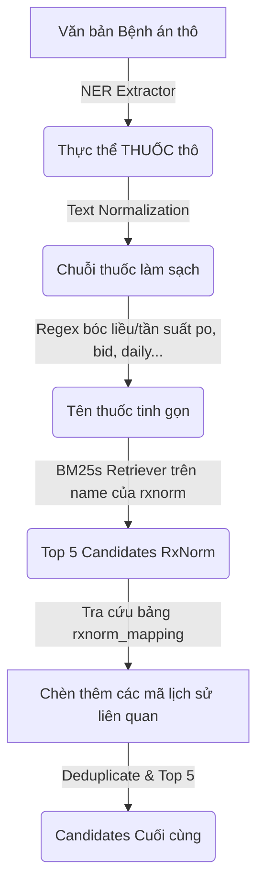

# Phân tích & Tích hợp Bộ dữ liệu RxNorm (Thuốc)

Tài liệu này trình bày chi tiết kết quả phân tích nghiệp vụ tập dữ liệu chuẩn hóa thuốc lâm sàng RxNorm của Thư viện Y khoa Quốc gia Hoa Kỳ (NLM) và giải pháp kỹ thuật tích hợp vào hệ thống AI Race Viettel.

---

## 1. Phân tích Dữ liệu Nguồn (RxNorm_full_07062026.zip)

* **Nguồn gốc**: Gói phát hành đầy đủ (Full Release) của RxNorm phát hành bởi NLM ngày 07/06/2026.
* **Quy mô dữ liệu**:
  * Chứa **362,401 bản ghi từ vựng sạch** (lọc từ `rrf/RXNCONSO.RRF`).
  * Chứa **372,592 bản ghi ánh xạ lịch sử** (lọc từ `rrf/RXNATOMARCHIVE.RRF`).

### Các Phát hiện Nghiệp vụ Quan trọng:

#### A. Tại sao bắt buộc dùng bản Full và giữ cờ Obsolete (`SUPPRESS = 'O'`)?
* Bộ phát hành RxNorm chia làm 2 tập con chính:
  1. `prescribe/` (Chỉ chứa thuốc đang lưu hành ở Mỹ): Lọc bỏ 100% thuốc có cờ `SUPPRESS = 'Y'` hoặc `SUPPRESS = 'O'`.
  2. `rrf/` (Bản đầy đủ): Chứa cả thuốc hiện hành lẫn thuốc cũ/lưu trữ trong lịch sử.
* **Kiểm chứng thực tế**: 
  Trong đề bài và Ground Truth của cuộc thi, các ví dụ về thuốc như:
  * `"chlorpheniramine 0.4 MG/ML"` (Mã RxCUI tương ứng: `315643`)
  * `"capsaicin 0.38 MG/ML"` (Mã RxCUI tương ứng: `1660760` hoặc `1660761`)
  Đều đã bị NLM đánh dấu ngừng lưu hành tại Mỹ và mang cờ **`SUPPRESS = 'O'` (Obsolete)**.
* **Kết luận**: Nếu hệ thống chỉ sử dụng bộ `prescribe/`, chúng ta sẽ hoàn toàn **không tìm thấy** và bị sót các mã này, dẫn tới mất điểm nghiêm trọng. Do đó, bắt buộc phải nạp dữ liệu từ bản full `rrf/` và giữ lại cờ `SUPPRESS = 'O'` (lọc `SUPPRESS != 'Y'`).

#### B. Khôi phục mã lịch sử bằng `RXNATOMARCHIVE.RRF` thay vì `RXNCUI.RRF`
* Tệp `RXNCUI.RRF` thông thường chỉ ghi nhận lịch sử thay đổi mã cho nhóm thuốc thành phẩm (`SCD`, `SBD`).
* Trong bệnh án lâm sàng Việt Nam, các bác sĩ chủ yếu viết tên hoạt chất gốc (`IN` - ví dụ: *"paracetamol"*, *"metoprolol"*). Khi hoạt chất gốc bị thay đổi/gộp mã ở các phiên bản cũ, `RXNCUI.RRF` không chứa thông tin ánh xạ hoạt chất.
* Ta phải sử dụng tệp `RXNATOMARCHIVE.RRF` (chứa 373k dòng lịch sử của mọi Term Type) và lọc theo nguồn `SAB = 'RXNORM'` với index cột chính xác:
  * `parts[0]` $\rightarrow$ `old_cui` (Mã cũ bị thay thế/lưu trữ).
  * `parts[6]` $\rightarrow$ `new_cui` (Mã hiện hành đích).
  * `parts[13]` $\rightarrow$ `sab`.

---

## 2. Thiết kế Cơ sở Dữ liệu SQLite (`metadata.db`)

Dữ liệu thuốc được lưu trữ trong 2 bảng CSDL chính:

### Bảng `rxnorm` (Từ điển thuốc và hoạt chất chính)
```sql
CREATE TABLE IF NOT EXISTS rxnorm (
    rxcui TEXT,
    name TEXT,
    tty TEXT
);
CREATE INDEX IF NOT EXISTS idx_rxnorm_rxcui ON rxnorm(rxcui);
CREATE INDEX IF NOT EXISTS idx_rxnorm_name ON rxnorm(name);
```

### Bảng `rxnorm_mapping` (Ánh xạ gộp mã lịch sử)
```sql
CREATE TABLE IF NOT EXISTS rxnorm_mapping (
    old_cui TEXT,
    new_cui TEXT,
    PRIMARY KEY (old_cui, new_cui)
);
```

---

## 3. Quy trình Tích hợp và Xử lý trong Pipeline

Quy trình xử lý thực thể `THUỐC` trong pipeline diễn ra qua các bước sau:



1. **NER Extractor**: Trích xuất thực thể thuốc lâm sàng (ví dụ: `"metoprolol 25mg po bid"`).
2. **Text Normalization**: 
   * Chuẩn hóa khoảng trắng và chuyển chữ thường.
   * Sử dụng regex để bóc tách/loại bỏ tần suất, cách dùng lâm sàng (ví dụ: *po, bid, qid, daily, prn, uống, tiêm...*) ra khỏi chuỗi để giảm nhiễu lexical khi so khớp.
3. **Lexical Retrieval (BM25)**: Tra cứu tương đồng BM25 trên bảng `rxnorm` trong SQLite để tìm ra Top 5 mã `rxcui` có điểm số cao nhất.
4. **Historical Resolution**:
   * Với mỗi mã `rxcui` tìm được, tra cứu bảng `rxnorm_mapping` để tìm tất cả các mã cũ trong lịch sử đã được gộp thành mã này.
   * Chèn các mã cũ tìm thấy vào danh sách candidates.
   * *Lưu ý*: Tính năng này được cấu hình tùy chọn để chạy A/B test trên Leaderboard thật nhằm tối ưu hóa điểm số.
5. **Deduplication**: Loại bỏ trùng lặp và giữ lại tối đa 5 candidates cuối cùng.
