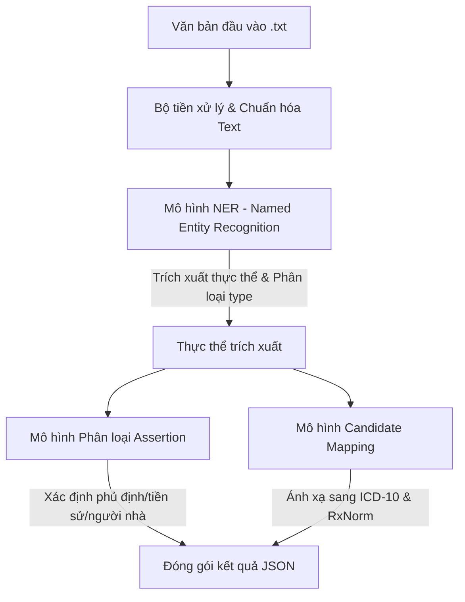

# Phân tích Chi tiết Đề bài: AI Race 2026 - Bài 2
## Ontological Reasoning in Medical Knowledge Retrieval

---

### 1. Tổng quan & Bối cảnh cuộc thi
* **Tên bài toán:** Ontological Reasoning in Medical Knowledge Retrieval (Suy luận Ontology trong Truy vấn Tri thức Y khoa).
* **Mục tiêu:** Xây dựng hệ thống AI xử lý văn bản y khoa tự do (free-form clinical text) nhằm:
  1. Phát hiện và trích xuất các khái niệm y tế chuyên môn.
  2. Chuẩn hóa các khái niệm y tế về các danh mục chuẩn quốc tế (ICD-10 và RxNorm).
  3. Suy luận các mối quan hệ ngữ cảnh (như phủ định, thông tin tiền sử hoặc thông tin gia đình) của các khái niệm đó.
* **Bối cảnh & Thử thách:**
  * Dữ liệu lâm sàng thực tế (EHR, ghi chú bác sĩ, giấy xuất viện...) rất hỗn loạn, không có cấu trúc chuẩn.
  * Sử dụng nhiều từ viết tắt, thuật ngữ địa phương, lỗi chính tả, cách diễn đạt đa dạng và các ký hiệu chuyên ngành phức tạp.
  * Một câu có thể lồng ghép nhiều thông tin đan xen nhau (ví dụ: kết quả xét nghiệm đi kèm tên xét nghiệm, tên thuốc kèm liều lượng và ngữ cảnh sử dụng).

---

### 2. Lộ trình & Quy chế Vòng thi (Vòng 1 - Sơ loại)
* **Thời gian Vòng 1:** 02/07/2026 – 30/07/2026.
* **Tần suất nộp bài:** Tối đa **5 lần/ngày**, mỗi lần nộp cách nhau ít nhất **600 giây (10 phút)**.
* **Hình thức nộp bài:** File nén `output.zip` chứa các file JSON dự đoán cho tập test.
* **Quy định chống gian lận (Rất quan trọng):**
  * Trước khi kết thúc Vòng 1, **Top ~15 đội** dẫn đầu trên Bảng xếp hạng (Leaderboard) bắt buộc phải gửi source code cho Ban tổ chức (BTC) để tái lập kết quả trên tập **Private Test**.
  * Source code nộp phải bao gồm:
    * Toàn bộ mã nguồn xử lý (tiền xử lý dữ liệu, huấn luyện, suy luận...).
    * Dữ liệu bổ sung mà đội thi đã sử dụng.
    * Model weights (trọng số mô hình).
    * File `README.md` hướng dẫn cài đặt và chạy chi tiết.
  * Đội thi sẽ bị loại nếu BTC không thể cài đặt và chạy lại được source code trong thời gian quy định hỗ trợ.

---

### 3. Mô tả chi tiết Dữ liệu Đầu vào & Đầu ra

#### 3.1 Dữ liệu Đầu vào (Input)
* Tập test gồm 100 file văn bản thô `.txt` được đóng gói trong `test.zip` theo cấu trúc:
  ```text
  test/
  └── input/
      ├── 1.txt
      ├── 2.txt
      └── ...
      └── 100.txt
  ```
* Mỗi file `.txt` chứa một đoạn văn bản y tế dạng tự do.

#### 3.2 Dữ liệu Đầu ra (Output)
* Thí sinh cần nộp file `output.zip` khi giải nén ra sẽ có cấu trúc:
  ```text
  output/
  ├── 1.json
  ├── 2.json
  └── ...
  └── 100.json
  ```
* Mỗi file `.json` chứa một **danh sách các đối tượng JSON (List of Dictionaries)**, mỗi đối tượng đại diện cho một khái niệm y tế trích xuất được với các trường thông tin sau:

| Trường thông tin | Kiểu dữ liệu | Mô tả chi tiết |
| :--- | :--- | :--- |
| **`text`** | String | Cụm từ chính xác được trích xuất từ văn bản đầu vào. |
| **`position`** | List[int] | Gồm 2 phần tử `[start, end]` xác định vị trí ký tự của cụm từ trong văn bản (0-indexed). Trong đó `start` là vị trí ký tự đầu tiên, và `end` là vị trí ngay sau ký tự cuối cùng (`end = start + len(text)`). |
| **`type`** | String | Nhãn phân loại của khái niệm. Chỉ nhận một trong các giá trị:<br>- `TRIỆU_CHỨNG`: Triệu chứng bệnh nhân gặp phải.<br>- `TÊN_XÉT_NGHIỆM`: Tên của chỉ số/phương pháp xét nghiệm.<br>- `KẾT_QUẢ_XÉT_NGHIỆM`: Chỉ số kết quả xét nghiệm (thường gồm giá trị số + đơn vị).<br>- `CHẨN_ĐOÁN`: Tên bệnh hoặc kết luận chẩn đoán của bác sĩ.<br>- `THUỐC`: Tên thuốc điều trị kèm hàm lượng/liều dùng nếu có. |
| **`assertions`** | List[String] | Các thuộc tính ngữ cảnh của khái niệm (chỉ áp dụng đối với `CHẨN_ĐOÁN`, `THUỐC`, và `TRIỆU_CHỨNG`). Danh sách chứa tối đa 3 nhãn:<br>- `"isNegated"`: Bị phủ định trong ngữ cảnh (Ví dụ: *"không ho"*, *"chưa phát hiện u"*).<br>- `"isFamily"`: Tình trạng thuộc về người thân/gia đình bệnh nhân chứ không phải bản thân bệnh nhân.<br>- `"isHistorical"`: Tiền sử bệnh hoặc thuốc đã dùng trong quá khứ trước đợt khám này. |
| **`candidates`** | List[String] | Danh sách mã ánh xạ thực thể chuẩn (chỉ áp dụng đối với `CHẨN_ĐOÁN` và `THUỐC`):<br>- Ánh xạ bệnh (`CHẨN_ĐOÁN`) sang mã **ICD-10** tương ứng.<br>- Ánh xạ thuốc (`THUỐC`) sang mã **RxNorm** tương ứng. |

#### 3.3 Ví dụ minh họa chi tiết
* **Văn bản đầu vào (`input`):**
  > *"Danh sách thuốc trước nhập viện chính xác và đầy đủ. 1. amlodipine 10 mg po daily..."*
* **Kết quả đầu ra tương ứng (`output`):**
  ```json
  [
    {
      "text": "amlodipine 10 mg po daily",
      "type": "THUỐC",
      "candidates": ["308135"],
      "assertions": ["isHistorical"],
      "position": [58, 83]
    }
  ]
  ```

---

### 4. Phương pháp Đánh giá (Metrics)

Điểm số cuối cùng của tập test được tính dựa trên tổ hợp của 3 thành phần điểm:
$$\text{final\_score} = 0.3 \times \text{text\_score} + 0.3 \times \text{assertions\_score} + 0.4 \times \text{candidates\_score}$$

#### 4.1 Điểm trích xuất thực thể (`text_score`)
Đánh giá mức độ chính xác khi nhận diện chuỗi văn bản của khái niệm, sử dụng chỉ số **Word Error Rate (WER)**:
$$\text{text\_score} = \frac{\sum_{i \in \text{test}} (1 - \text{WER}(i))}{\text{len}(\text{test})}$$
*Điểm số càng cao khi văn bản trích xuất càng khớp với nhãn gốc.*

#### 4.2 Điểm suy luận ngữ cảnh (`assertions_score`)
Đánh giá mức độ chính xác khi gán nhãn thuộc tính ngữ cảnh (`isNegated`, `isFamily`, `isHistorical`) bằng độ tương đồng **Jaccard**:
$$\text{assertions\_score} = \frac{\sum_{i \in \text{test}} J_{\text{assertions}}(i)}{\text{len}(\text{test})}$$

#### 4.3 Điểm ánh xạ thực thể chuẩn (`candidates_score`)
Đánh giá mức độ chính xác khi tìm mã ICD-10 / RxNorm tương ứng, sử dụng độ tương đồng **Jaccard** có trọng số theo số lượng nhãn chuẩn:
$$\text{candidates\_score} = \frac{\sum_{i \in \text{test}} J_{\text{candidates}}(i) \times \left( \sum_{k \in i} (\text{len}(\text{ground\_truth}(k)) + 1) \right)}{\sum_{i \in \text{test}} \sum_{k \in i} (\text{len}(\text{ground\_truth}(k)) + 1)}$$

#### 4.4 Cách tính độ tương đồng Jaccard ($J_X(i)$) cho một mẫu $i$
Với mỗi thuộc tính ngữ cảnh hoặc tập hợp mã mapping $X$:
* $J_X(i) = 1$ nếu cả tập thực tế (ground truth) và dự đoán (prediction) của trường $X$ đều rỗng ($\emptyset$).
* $J_X(i) = 0$ nếu tập thực tế rỗng nhưng dự đoán lại có phần tử, hoặc ngược lại.
* $J_X(i) = \frac{|\text{ground\_truth}_X(i) \cap \text{prediction}_X(i)|}{|\text{ground\_truth}_X(i) \cup \text{prediction}_X(i)|}$ trong các trường hợp còn lại.

> [!WARNING]
> **Hình phạt nặng khi gán sai Loại khái niệm (`type`):**
> Trong trường hợp mô hình trích xuất đúng văn bản (`text`) nhưng phân loại sai trường `type` (Ví dụ: nhãn gốc là `TRIỆU_CHỨNG` nhưng mô hình đoán là `CHẨN_ĐOÁN`), hệ thống sẽ tính là **thừa 1 thực thể dự đoán sai** và **thiếu 1 thực thể thực tế**. Cả hai thực thể này đều bị tính điểm bằng 0 cho cả 3 metric. Do đó, việc phân loại thực thể (`type`) chính xác tuyệt đối là yếu tố sống còn của mô hình.

---

### 5. Ràng buộc về Tài nguyên kỹ thuật
* Thí sinh tự chuẩn bị tài nguyên tính toán để chạy mô hình.
* **Quy định đối với giải pháp sử dụng LLM/Agent:**
  * **Cấm sử dụng API ngoài** (như GPT-4, Claude 3.5, Gemini API trực tiếp trong lúc chấm bài kiểm thử).
  * Chỉ cho phép các giải pháp **self-host model**.
  * Kích thước mô hình self-host tối đa là **9 tỷ tham số (9B params)** (Ví dụ: Llama-3-8B, Qwen-2-7B, Mistral-7B, PhoGPT...).

---

### 6. Hướng Tiếp cận Đề xuất

Để xây dựng một hệ thống tối ưu đáp ứng toàn bộ các yêu cầu trên, chúng ta có thể thiết kế pipeline theo cấu trúc sau:



1. **Bước 1: Named Entity Recognition (NER) & Classification**
   * Sử dụng các kiến trúc BERT chuyên biệt cho y tế (như *BioBERT*, *ClinicalBERT*, hoặc *PhoBERT* tinh chỉnh cho tiếng Việt) để nhận diện các thực thể lâm sàng và phân loại chúng vào 5 nhóm `type`.
   * Đối với tiếng Việt y khoa, có thể kết hợp thêm bộ luật từ điển (dictionary-based lookup) để cải thiện độ phủ.
2. **Bước 2: Assertion Classification**
   * Đối với mỗi thực thể thuộc loại `CHẨN_ĐOÁN`, `THUỐC`, `TRIỆU_CHỨNG`, tiến hành trích xuất câu chứa thực thể đó và đưa vào mô hình phân loại đa nhãn (Multi-label Classification) hoặc Prompting trên các LLM 7B/8B để phát hiện các thuộc tính ngữ cảnh (`isNegated`, `isFamily`, `isHistorical`).
3. **Bước 3: Entity Linking / Candidate Mapping**
   * Sử dụng phương pháp truy vấn tương đồng (Semantic Search / Vector Search) kết hợp thuật toán so khớp chuỗi (TF-IDF, BM25, Edit Distance) để so sánh thực thể trích xuất với CSDL chuẩn ICD-10 và RxNorm.
   * Do CSDL RxNorm chủ yếu là tiếng Anh và ICD-10 có cả bản tiếng Anh lẫn tiếng Việt, việc dịch thuật ngữ hoặc sử dụng mô hình embedding đa ngôn ngữ chuyên ngành y tế (như *BioSentVec*) là vô cùng cần thiết.
4. **Bước 4: Hậu xử lý & Rà soát vị trí ký tự (`position`)**
   * Đảm bảo tính toán chính xác chỉ số `start` và `end` của thực thể trong chuỗi văn bản gốc để không bị lệch điểm do lỗi căn lề hoặc xử lý khoảng trắng.