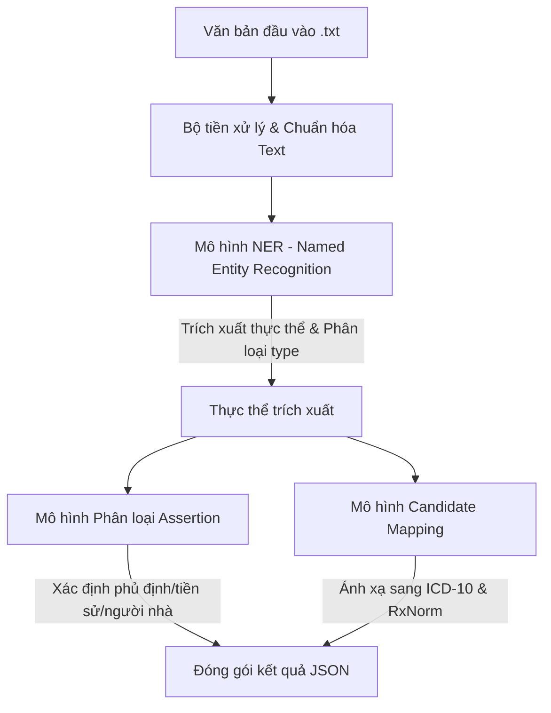

# Phân tích Chi tiết Đề bài: AI Race 2026 - Bài 2
## Ontological Reasoning in Medical Knowledge Retrieval

---

### 1. Tổng quan & Bối cảnh cuộc thi
* **Tên bài toán:** Ontological Reasoning in Medical Knowledge Retrieval (Suy luận Ontology trong Truy vấn Tri thức Y khoa).
* **Mục tiêu:** Xây dựng hệ thống AI xử lý văn bản y khoa tự do (free-form clinical text) nhằm:
  1. Phát hiện và trích xuất các khái niệm y tế chuyên môn.
  2. Chuẩn hóa các khái niệm y tế về các danh mục chuẩn quốc tế (ICD-10 và RxNorm).
  3. Suy luận các mối quan hệ ngữ cảnh (như phủ định, thông tin tiền sử hoặc thông tin gia đình) của các khái niệm đó.
* **Bối cảnh & Thử thách:**
  * Dữ liệu lâm sàng thực tế (EHR, ghi chú bác sĩ, giấy xuất viện...) rất hỗn loạn, không có cấu trúc chuẩn.
  * Sử dụng nhiều từ viết tắt, thuật ngữ địa phương, lỗi chính tả, cách diễn đạt đa dạng và các ký hiệu chuyên ngành phức tạp.
  * Một câu có thể lồng ghép nhiều thông tin đan xen nhau (ví dụ: kết quả xét nghiệm đi kèm tên xét nghiệm, tên thuốc kèm liều lượng và ngữ cảnh sử dụng).

---

### 2. Lộ trình & Quy chế Vòng thi (Toàn bộ 3 giai đoạn)
Cuộc thi gồm có 3 giai đoạn (Phase) chính với lộ trình cụ thể như sau:
* **Phase 1: Vòng 1 - Sơ loại (02/07/2026 – 30/07/2026)**
  * **Hình thức nộp bài:** Nộp file nén `output.zip` chứa các file JSON dự đoán cho tập Public Test.
  * **Tần suất nộp bài:** Tối đa **5 lần/ngày**, mỗi lần nộp cách nhau ít nhất **600 giây (10 phút)**.
  * **Quy định chống gian lận (Rất quan trọng):** Trước khi kết thúc Vòng 1, **Top ~15 đội** dẫn đầu trên Bảng xếp hạng (Leaderboard) bắt buộc phải gửi source code cho Ban tổ chức (BTC) để tái lập kết quả trên tập **Private Test**. Source code nộp phải bao gồm:
    * Toàn bộ mã nguồn xử lý (tiền xử lý dữ liệu, huấn luyện, suy luận...).
    * Dữ liệu bổ sung mà đội thi đã sử dụng.
    * Model weights (trọng số mô hình).
    * File `README.md` hướng dẫn cài đặt và chạy chi tiết.
    * Đội thi sẽ bị loại nếu BTC không thể cài đặt và chạy lại được source code trong thời gian quy định hỗ trợ.
* **Phase 2: Vòng 2 - Sơ khảo (17/08/2026 – 19/08/2026)**
  * **Hình thức nộp bài:** Chạy mô hình và nộp kết quả thông qua **API endpoint** trên hạ tầng GPU do BTC quản lý/chỉ định.
* **Phase 3: Vòng 3 - Chung kết (09/09/2026 – 10/09/2026)**
  * **Hình thức nộp bài:** Tương tự Vòng 2, nộp kết quả trực tiếp qua **API endpoint** trên hạ tầng GPU.

---

### 3. Mô tả chi tiết Dữ liệu Đầu vào & Đầu ra

#### 3.1 Dữ liệu Đầu vào (Input)
* Tập test gồm 100 file văn bản thô `.txt` được đóng gói trong `test.zip` theo cấu trúc:
  ```text
  test/
  └── input/
      ├── 1.txt
      ├── 2.txt
      └── ...
      └── 100.txt
  ```
* Mỗi file `.txt` chứa một đoạn văn bản y tế dạng tự do.

#### 3.2 Dữ liệu Đầu ra (Output)
* Thí sinh cần nộp file `output.zip` khi giải nén ra sẽ có cấu trúc:
  ```text
  output/
  ├── 1.json
  ├── 2.json
  └── ...
  └── 100.json
  ```
* Mỗi file `.json` chứa một **danh sách các đối tượng JSON (List of Dictionaries)**, mỗi đối tượng đại diện cho một khái niệm y tế trích xuất được với các trường thông tin sau:

| Trường thông tin | Kiểu dữ liệu | Phạm vi áp dụng | Mô tả chi tiết |
| :--- | :--- | :--- | :--- |
| **`text`** | String | Mọi thực thể | Cụm từ chính xác được trích xuất từ văn bản đầu vào. |
| **`position`** | List[int] | Mọi thực thể | Gồm 2 phần tử `[start, end]` xác định vị trí ký tự của cụm từ trong văn bản (0-indexed). Trong đó `start` là vị trí ký tự đầu tiên, và `end` là vị trí ngay sau ký tự cuối cùng (`end = start + len(text)`). |
| **`type`** | String | Mọi thực thể | Nhãn phân loại của khái niệm. Chỉ nhận một trong các giá trị:<br>- `TRIỆU_CHỨNG`: Triệu chứng bệnh nhân gặp phải.<br>- `TÊN_XÉT_NGHIỆM`: Tên của chỉ số/phương pháp xét nghiệm.<br>- `KẾT_QUẢ_XÉT_NGHIỆM`: Chỉ số kết quả xét nghiệm (thường gồm giá trị số + đơn vị).<br>- `CHẨN_ĐOÁN`: Tên bệnh hoặc kết luận chẩn đoán của bác sĩ.<br>- `THUỐC`: Tên thuốc điều trị kèm hàm lượng/liều dùng nếu có. |
| **`assertions`** | List[String] | `CHẨN_ĐOÁN`, `THUỐC`, `TRIỆU_CHỨNG` | Các thuộc tính ngữ cảnh của khái niệm. Danh sách chứa tối đa 3 nhãn:<br>- `"isNegated"`: Bị phủ định trong ngữ cảnh (Ví dụ: *"không ho"*, *"chưa phát hiện u"*).<br>- `"isFamily"`: Tình trạng thuộc về người thân/gia đình bệnh nhân chứ không phải bản thân bệnh nhân.<br>- `"isHistorical"`: Tiền sử bệnh hoặc thuốc đã dùng trong quá khứ trước đợt khám này. |
| **`candidates`** | List[String] | `CHẨN_ĐOÁN`, `THUỐC` | Danh sách mã ánh xạ thực thể chuẩn:<br>- Ánh xạ bệnh (`CHẨN_ĐOÁN`) sang mã **ICD-10** tương ứng.<br>- Ánh xạ thuốc (`THUỐC`) sang mã **RxNorm** tương ứng. |

> [!NOTE]
> Đối với các khái niệm thuộc loại `TÊN_XÉT_NGHIỆM` và `KẾT_QUẢ_XÉT_NGHIỆM`, cấu trúc JSON chỉ cần các trường `text`, `type` và `position` (các trường `assertions` và `candidates` không được sử dụng và không cần xuất hiện trong đối tượng).

#### 3.3 Ví dụ minh họa chi tiết
* **Văn bản đầu vào (`input`):**
  > *"Bệnh nhân nam 70 tuổi bị bệnh 1 tuần nay, ho đờm xanh, tức ngực, đau thượng vị, ợ hơi, bệnh nhân có tiền sử sử dụng Chlorpheniramine 0.4 MG/ML, Capsaicin 0.38 MG/ML, đã tiến hành tổng phân tích tế bào máu bằng máy lazer (tbm): WBC:14,43; NEUT% (Tỷ lệ % bạch cầu trung tính):76,4; LYPH% (Tỷ lệ bạch cầu lympho):12,8;"*
* **Kết quả đầu ra tương ứng (`output`):**
  ```json
  [
    {
      "text": "bệnh trào ngược dạ dày - thực quản",
      "type": "CHẨN_ĐOÁN",
      "candidates": ["K21.0", "K21.9"],
      "assertions": [],
      "position": [0, 0]
    },
    {
      "text": "ho đờm xanh",
      "type": "TRIỆU_CHỨNG",
      "assertions": [],
      "position": [31, 42]
    },
    {
      "text": "tức ngực",
      "type": "TRIỆU_CHỨNG",
      "assertions": [],
      "position": [44, 52]
    },
    {
      "text": "đau thượng vị",
      "type": "TRIỆU_CHỨNG",
      "assertions": [],
      "position": [54, 67]
    },
    {
      "text": "ợ hơi",
      "type": "TRIỆU_CHỨNG",
      "assertions": [],
      "position": [69, 74]
    },
    {
      "text": "Chlorpheniramine 0.4 MG/ML",
      "type": "THUỐC",
      "candidates": ["360047"],
      "assertions": ["isHistorical"],
      "position": [102, 128]
    },
    {
      "text": "Capsaicin 0.38 MG/ML",
      "type": "THUỐC",
      "candidates": ["1660761"],
      "assertions": ["isHistorical"],
      "position": [130, 150]
    },
    {
      "text": "WBC",
      "type": "TÊN_XÉT_NGHIỆM",
      "position": [215, 218]
    },
    {
      "text": "14,43",
      "type": "KẾT_QUẢ_XÉT_NGHIỆM",
      "position": [219, 224]
    },
    {
      "text": "NEUT% (Tỷ lệ % bạch cầu trung tính)",
      "type": "TÊN_XÉT_NGHIỆM",
      "position": [226, 261]
    },
    {
      "text": "76,4",
      "type": "KẾT_QUẢ_XÉT_NGHIỆM",
      "position": [262, 266]
    },
    {
      "text": "LYPH% (Tỷ lệ bạch cầu lympho)",
      "type": "TÊN_XÉT_NGHIỆM",
      "position": [268, 297]
    },
    {
      "text": "12,8",
      "type": "KẾT_QUẢ_XÉT_NGHIỆM",
      "position": [298, 302]
    }
  ]
  ```

---

### 4. Phương pháp Đánh giá (Metrics) & Thuật toán Khớp cặp

Điểm số cuối cùng của mỗi tập test được tính dựa trên tổ hợp của 3 thành phần điểm:
$$\text{final\_score} = 0.3 \times \text{text\_score} + 0.3 \times \text{assertions\_score} + 0.4 \times \text{candidates\_score}$$

Để tính được các điểm thành phần, hệ thống sử dụng thuật toán khớp cặp thực thể trước:

#### 4.1 Thuật toán Khớp cặp Thực thể (Bipartite Greedy Matching)
Do số lượng thực thể thực tế (Ground Truth - GT) và dự đoán (Prediction - Pred) có thể lệch nhau, hệ thống thực hiện khớp cặp tham lam (Greedy Bipartite Matching) giữa hai tập theo tiêu chí:
1. **Trùng khớp hoàn toàn về `type`**.
2. **Độ giao nhau vị trí ký tự (Intersection over Union - IoU) phải $\ge 0.5$** (ngưỡng mặc định `iou_threshold = 0.5`). 
   $$\text{IoU}(\text{pos1}, \text{pos2}) = \frac{\text{Inter}(\text{pos1}, \text{pos2})}{\text{Union}(\text{pos1}, \text{pos2})}$$
Thuật toán ưu tiên ghép các cặp thực thể có IoU từ cao xuống thấp. Các thực thể không thể ghép cặp được ghi nhận là:
* **False Negative (FN - Thiếu thực tế):** Thực thể có trong GT nhưng mô hình không dự đoán ra.
* **False Positive (FP - Thừa dự đoán):** Thực thể mô hình dự đoán ra nhưng không có trong GT.

#### 4.2 Điểm trích xuất thực thể (`text_score`)
Đánh giá độ chính xác nhận diện chuỗi văn bản của khái niệm, sử dụng chỉ số **Word Error Rate (WER)** (dựa trên khoảng cách Levenshtein ở mức độ từ và không phân biệt chữ hoa/thường):
$$\text{text\_score} = \frac{\sum_{\text{matches}} (1 - \text{WER}(i))}{\text{len}(\text{matches}) + \text{len}(\text{FN}) + \text{len}(\text{FP})}$$
*Nếu tập thực thể rỗng ở cả hai phía, điểm số đạt 1.0.*

#### 4.3 Điểm suy luận ngữ cảnh (`assertions_score`)
Đánh giá độ chính xác gán nhãn thuộc tính ngữ cảnh (`isNegated`, `isFamily`, `isHistorical`) trên các thực thể đã khớp cặp (chỉ áp dụng cho `CHẨN_ĐOÁN`, `THUỐC`, `TRIỆU_CHỨNG`), sử dụng độ tương đồng **Jaccard**:
$$\text{assertions\_score} = \frac{\sum_{\text{matches}} J_{\text{assertions}}(i)}{\text{len}(\text{matches\_assert}) + \text{len}(\text{FN\_assert}) + \text{len}(\text{FP\_assert})}$$
Quy tắc tính Jaccard ($J$) cho mỗi cặp hoặc thực thể đơn lẻ:
* $J = 1.0$ nếu cả danh sách thực tế và dự đoán đều rỗng (không có thuộc tính ngữ cảnh nào được gán).
* $J = 0.0$ nếu một bên rỗng nhưng bên kia có phần tử.
* $J = \frac{|\text{GT} \cap \text{Pred}|}{|\text{GT} \cup \text{Pred}|}$ trong các trường hợp còn lại.

#### 4.4 Điểm ánh xạ thực thể chuẩn (`candidates_score`)
Đánh giá độ chính xác tìm mã ICD-10 / RxNorm tương ứng trên các thực thể đã khớp cặp (chỉ áp dụng cho `CHẨN_ĐOÁN`, `THUỐC`), sử dụng độ tương đồng **Jaccard** có trọng số theo số lượng nhãn chuẩn:
$$\text{candidates\_score} = \frac{\sum_{\text{samples}} J_{\text{candidates}}(\text{sample}) \times W(\text{sample})}{\sum_{\text{samples}} W(\text{sample})}$$
Trọng số của mỗi mẫu $i$ ($W(i)$) được tính hoàn toàn dựa trên nhãn chuẩn (Ground Truth) để đảm bảo tính khách quan:
$$W(i) = \sum_{k \in \text{sample } i, k \in \{\text{CHẨN\_ĐOÁN}, \text{THUỐC}\}} (\text{len}(\text{ground\_truth\_candidates}(k)) + 1)$$

#### 4.5 Các lưu ý đặc biệt về Tiền xử lý & Chuẩn hóa của hệ thống chấm điểm
* **Không phân biệt hoa thường trong Text:** Hệ thống so khớp văn bản không phân biệt hoa thường.
* **Loại bỏ khoảng trắng dư thừa:** Các chuỗi văn bản, nhãn ngữ cảnh và mã ứng viên đều được loại bỏ khoảng trắng thừa (`strip()`).
* **Chuẩn hóa mã code:** Toàn bộ mã ứng viên (ICD-10 và RxNorm) đều được chuyển về chữ in hoa (`upper()`) trước khi tính toán Jaccard.
* **Cách ly lỗi:** Hệ thống chấm điểm cách ly lỗi theo mẫu (sample-level). Nếu một mẫu dự đoán bị sai định dạng cấu trúc, mẫu đó sẽ nhận điểm 0 và không làm sập tiến trình chấm điểm toàn bộ tập dữ liệu.

> [!WARNING]
> **Hình phạt nặng khi gán sai Loại khái niệm (`type`):**
> Trong trường hợp mô hình trích xuất đúng văn bản (`text`) nhưng phân loại sai trường `type` (Ví dụ: nhãn gốc là `TRIỆU_CHỨNG` nhưng mô hình đoán là `CHẨN_ĐOÁN`), hệ thống sẽ **không khớp cặp được**. 
> Việc này dẫn tới **thừa 1 thực thể dự đoán sai (FP)** và **thiếu 1 thực thể thực tế (FN)**. Cả hai thực thể này đều bị tính điểm bằng 0 cho cả 3 metric. Do đó, việc phân loại thực thể (`type`) chính xác tuyệt đối là yếu tố sống còn của mô hình.

---

### 5. Ràng buộc & Yêu cầu kỹ thuật
* Thí sinh tự chuẩn bị tài nguyên tính toán để huấn luyện và phát triển mô hình.
* **Quy định đối với giải pháp sử dụng LLM/Agent:**
  * **Cấm sử dụng API thương mại bên ngoài** (như GPT-4, Claude 3.5, Gemini API trực tiếp trong lúc chấm bài kiểm thử).
  * Chỉ cho phép các giải pháp **self-host model** trên hạ tầng được chỉ định.
  * Kích thước mô hình self-host tối đa là **9 tỷ tham số (9B params)** (Ví dụ: Llama-3-8B, Qwen-2-7B, Mistral-7B, PhoGPT...).

---

### 6. Hướng Tiếp cận Đề xuất

Để xây dựng một hệ thống tối ưu đáp ứng toàn bộ các yêu cầu trên, chúng ta có thể thiết kế pipeline theo cấu trúc sau:



1. **Bước 1: Named Entity Recognition (NER) & Classification**
   * Sử dụng các kiến trúc BERT chuyên biệt cho y tế (như *BioBERT*, *ClinicalBERT*, hoặc *PhoBERT* tinh chỉnh cho tiếng Việt) để nhận diện các thực thể lâm sàng và phân loại chúng vào 5 nhóm `type`.
   * Đối với tiếng Việt y khoa, có thể kết hợp thêm bộ luật từ điển (dictionary-based lookup) để cải thiện độ phủ.
2. **Bước 2: Assertion Classification**
   * Đối với mỗi thực thể thuộc loại `CHẨN_ĐOÁN`, `THUỐC`, `TRIỆU_CHỨNG`, tiến hành trích xuất câu chứa thực thể đó và đưa vào mô hình phân loại đa nhãn (Multi-label Classification) hoặc Prompting trên các LLM 7B/8B để phát hiện các thuộc tính ngữ cảnh (`isNegated`, `isFamily`, `isHistorical`).
3. **Bước 3: Entity Linking / Candidate Mapping**
   * Sử dụng phương pháp truy vấn tương đồng (Semantic Search / Vector Search) kết hợp thuật toán so khớp chuỗi (TF-IDF, BM25, Edit Distance) để so sánh thực thể trích xuất với CSDL chuẩn ICD-10 và RxNorm.
   * Do CSDL RxNorm chủ yếu là tiếng Anh và ICD-10 có cả bản tiếng Anh lẫn tiếng Việt, việc dịch thuật ngữ hoặc sử dụng mô hình embedding đa ngôn ngữ chuyên ngành y tế (như *BioSentVec*) là vô cùng cần thiết.
4. **Bước 4: Hậu xử lý & Rà soát vị trí ký tự (`position`)**
   * Đảm bảo tính toán chính xác chỉ số `start` và `end` của thực thể trong chuỗi văn bản gốc để không bị lệch điểm do lỗi căn lề hoặc xử lý khoảng trắng.