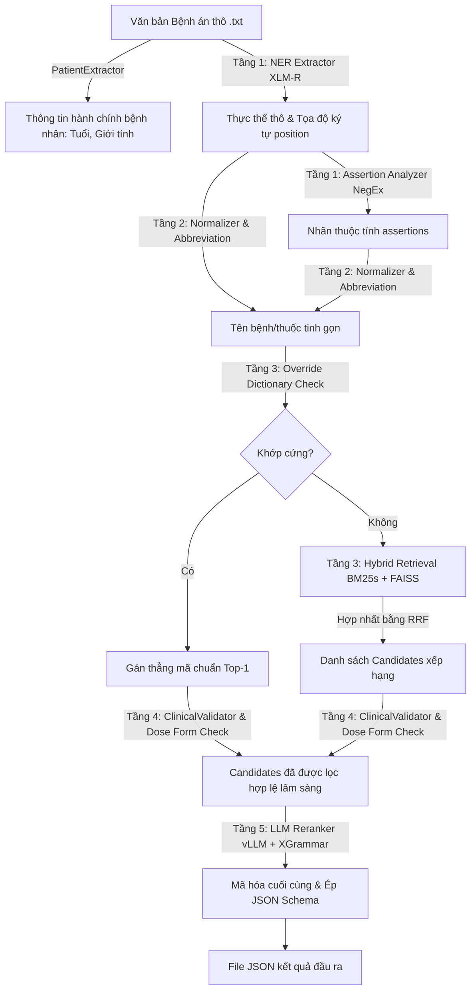

# Tài liệu Thiết kế Pipeline Chi tiết — AI Race Viettel 2026

Tài liệu này mô tả chi tiết kiến trúc, các cấu phần kỹ thuật và luồng dữ liệu (Data Flow) của pipeline xử lý ngôn ngữ tự nhiên lâm sàng song ngữ Việt-Anh trong hệ thống AI Race Viettel.

---

## 1. Tổng quan Kiến trúc Hệ thống

Pipeline của hệ thống được thiết kế theo mô hình **Modular Multi-Stage Pipeline**, bao gồm 5 tầng kết nối tuần tự nhằm chuyển đổi văn bản bệnh án thô thành cấu trúc dữ liệu JSON chuẩn đầu ra.

---

## 2. Chi tiết các Tầng xử lý

### Tầng 1: Extractor (NER & Assertion)
* **Trích xuất Thực thể (NER)**:
  * Mô hình backbone **XLM-RoBERTa-large + CRF** nhận diện 5 loại thực thể lâm sàng: `CHẨN_ĐOÁN`, `THUỐC`, `TRIỆU_CHỨNG`, `TÊN_XÉT_NGHIỆM`, `KẾT_QUẢ_XÉT_NGHIỆM`.
  * **Đồng bộ vị trí ký tự**: Sử dụng cơ chế `return_offsets_mapping` của fast tokenizer để trả về chính xác tọa độ bắt đầu và kết thúc (`position = [start, end]`) tính theo **Unicode codepoint** trên văn bản gốc.
* **Phân tích thuộc tính (Assertion)**:
  * Áp dụng thuật toán NegEx dạng rule-based trong [rule_based.py](../src/assertion/rule_based.py) để phân tích thuộc tính lâm sàng cho các thực thể `CHẨN_ĐOÁN`, `THUỐC`, và `TRIỆU_CHỨNG`.
  * Trích xuất các nhãn thuộc tính: `isNegated` (phủ định), `isFamily` (tiền sử gia đình), `isHistorical` (tiền sử bệnh lý của cá nhân).

### Tầng 2: Pre-processing & Normalization (Tiền xử lý & Chuẩn hoá)
* **Chuẩn hóa Unicode**: Đưa văn bản về dạng Unicode dựng sẵn chuẩn (NFC) và chuyển chữ thường.
* **Mở rộng viết tắt (Abbreviation Expansion)**: Tra cứu tệp từ điển từ viết tắt lâm sàng Việt Nam [abbreviations.json](../src/retrieval/abbreviations.json) để mở rộng các ký tự viết tắt (ví dụ: *THA $\rightarrow$ tăng huyết áp*, *ĐTĐ $\rightarrow$ đái tháo đường*) để cải thiện khả năng recall của retrieval.
* **Bóc tách liều lượng thuốc (Dosage Removal)**: Đối với thực thể `THUỐC`, sử dụng regex chuyên biệt trong `TextNormalizer` để loại bỏ các thông số hàm lượng, tần suất và đường dùng lâm sàng (ví dụ: *5mg, po, bid, daily...*) để thu được tên hoạt chất tinh gọn trước khi đem so khớp.

### Tầng 3: Hybrid Retrieval (Truy xuất lai)
* **Override Lookup (Chặn trước)**:
  * So khớp trực tiếp tên thực thể đã làm sạch với bảng ánh xạ tĩnh [override_dict.json](../data/kb/override_dict.json).
  * Nếu trùng khớp, gán ngay mã code của chẩn đoán (ICD-10) hoặc thuốc (RxNorm) mà không cần chạy qua các tầng tìm kiếm.
* **Hybrid Search (Nếu trượt override)**:
  * **Lexical Search**: BM25s tìm kiếm trên trường tên chẩn đoán song ngữ hoặc từ điển thuốc RxNorm của SQLite.
  * **Semantic Search**: FAISS tìm kiếm vector lân cận dựa trên embedding sinh bởi mô hình `bge-m3`.
  * **Hợp nhất (Fusion)**: Kết hợp kết quả từ hai công cụ bằng thuật toán **RRF (Reciprocal Rank Fusion)** với hằng số phạt rank $k = 60$.

### Tầng 4: Post-processing & Clinical Validation (Hậu xử lý y khoa)
* **Trích xuất thông tin hành chính**: `PatientExtractor` quét 150 ký tự đầu của bệnh án để tìm thông tin giới tính (`sex`) và tuổi bệnh nhân (`age_days`).
* **Lọc luật ICD-10**: Đối chiếu candidates của chẩn đoán với các bảng `icd10_rules_sex` và `icd10_rules_age` trong SQLite để loại bỏ các mã vi phạm giới tính/nhóm tuổi bệnh nhân.
* **Kiểm duyệt dạng bào chế RxNorm (Dose Form Checking)**: Đối chiếu từ khóa dạng dùng tiếng Việt trong văn bản thực thể (ví dụ: *uống, viên, tiêm, bôi...*) với tên dạng bào chế tiếng Anh trong cơ sở dữ liệu RxNorm (ví dụ: *Oral, Injection, Topical...*) để loại bỏ các mã thuốc có dạng bào chế mâu thuẫn rõ rệt.
* **Tích hợp lịch sử RxNorm**: Tra cứu bảng `rxnorm_mapping` để tự động chèn thêm mã cũ/lịch sử có liên quan cho các ứng viên thuốc.
* **Kiểm tra mã kép (Dual Code)**: Đối chiếu với luật `icd10_rules_dual` để tự động kiểm tra và bổ sung các mã phụ Asterisks bị thiếu nếu phát hiện mã chính Dagger.

### Tầng 5: LLM Reranker & Output Formatting
* **LLM Reranker**: Gọi mô hình Qwen-7B/8B Instruct offline bằng thư viện **vLLM** để xếp hạng lại danh sách candidates dựa trên ngữ cảnh lâm sàng phức tạp trong bệnh án.
* **Giải mã ràng buộc (Constrained Decoding)**: Cấu hình tham số của vLLM thông qua **XGrammar** để ép buộc mô hình sinh dữ liệu tuân thủ 100% JSON schema của cuộc thi, đồng thời ép buộc các mã candidates được chọn phải nằm trong dynamic enum (danh sách do Tầng 3 trả về).
* **Format Output và Fail-safe**:
  * Định dạng schema động: Loại bỏ các trường không hợp lệ đối với từng loại thực thể (`TRIỆU_CHỨNG` không có `candidates`; `TÊN_XÉT_NGHIỆM` và `KẾT_QUẢ_XÉT_NGHIỆM` không có `assertions` và `candidates`).
  * Khối `try-except` tổng bảo vệ: Nếu bất cứ tệp nào gặp sự cố xử lý, hệ thống sẽ tự động ghi kết quả rỗng `[]` và chuyển sang tệp tiếp theo mà không làm sập toàn bộ luồng chạy của pipeline.
