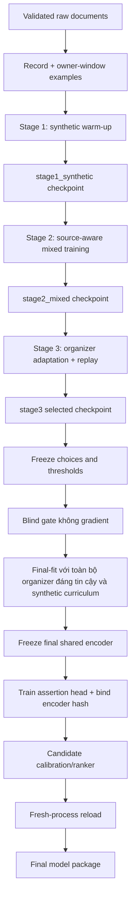

# Kế hoạch thực thi contract-first, resource-safe trên Kaggle

> **Cho session/agent tiếp theo:** triển khai theo từng work package, cập nhật checkbox
> và bằng chứng sau mỗi package. Không tự mở rộng phạm vi, không train local và không
> tuyên bố Kaggle thành công nếu chưa có artifact từ một `Run All` thật.

**Mục tiêu:** xây dựng một notebook Kaggle end-to-end nhận raw TXT/GT, kiểm tra dữ
liệu, chuyển dữ liệu thành record/chunk/tensor, huấn luyện curriculum ba stage,
train assertion và candidate policy, reload artifact rồi inference để tạo
`output.zip` đúng schema.

**Kiến trúc:** raw text luôn là nguồn chuẩn cho offset; metadata và normalized view
chỉ là sidecar. XLM-R là encoder chính cho NER và assertion; ICD-10/RxNorm retrieval
là nhánh recall độc lập; Qwen chỉ là reranker tùy chọn sau khi deterministic path đã
tạo được kết quả. Notebook chỉ điều phối module, không chứa bản sao business logic.

**Tech stack:** Python, PyTorch, Hugging Face Transformers, XLM-R,
scikit-learn/NumPy cho calibration nhẹ, JSON/JSONL, ICD-10/RxNorm runtime KB và
Kaggle notebook một GPU 16 GB.

**Design nguồn:**

- `docs/superpowers/specs/2026-07-23-contract-first-resource-safe-kaggle-design.md`
- `docs/superpowers/specs/2026-07-23-metadata-first-curriculum-training-design.md`

**Quy tắc ưu tiên:** tài liệu này là bản hợp nhất canonical cho thực thi. Các mục
`Hợp đồng dữ liệu từ raw đến tensor`, `Đặc trưng và model interface`,
`Luồng train canonical` và `Luồng model khi inference` trong plan này làm rõ và
thay thế mọi mô tả cũ mâu thuẫn về 1.600/400 development, final curriculum,
thời điểm freeze encoder và assertion binding. Các invariant dữ liệu/nhãn ở hai
design nguồn vẫn giữ nguyên.

**Phương pháp:** khóa contract → implement theo ownership → kiểm tra tĩnh/smoke
nhẹ → review độc lập → người dùng chạy Kaggle `Run All` và cung cấp log/artifact
để theo dõi, sửa lỗi, resume hoặc chạy lại. Không yêu cầu huấn luyện hay nghiệm
thu end-to-end trên máy local.

## Nguyên tắc điều phối

- Mặc định chỉ agent chính hoạt động. Chỉ mở agent phụ cho một review độc lập có
  phạm vi rõ; đóng ngay sau khi nhận report. Nếu có nhiều worker, mỗi worker chỉ sở
  hữu một nhóm file và không hoàn nguyên thay đổi của worker khác.
- Mỗi nhóm có report gồm diff, commands, kết quả regression và concern.
- Review kiểm tra spec compliance và code quality; finding quan trọng phải sửa
  trước khi qua nhóm kế tiếp.
- Dataset, model weights, `scratch/` và Kaggle downloads không được commit.
- Không tuyên bố Kaggle success khi chưa có một `Run All` thật.

## Ràng buộc toàn cục

- Tổng parameter của mọi weight set có thể tham gia tạo output không vượt 9B.
- ID 1–100 luôn `quarantine`, không fit, calibration hoặc model selection.
- ID 101–200 là organizer GT đáng tin cậy; không tự sửa GT.
- ID 201–2200 là 2.000 synthetic v2; không được âm thầm bỏ khỏi final curriculum.
- Synthetic quality baseline phải giữ 12 genre, khoảng 400 long-tail (20%), tối
  thiểu 411 ICD-10 và 414 RxNorm khác nhau, độ dài trung bình khoảng 413,8 từ và
  không fixed exact line trên toàn corpus; giảm quá 5% tương đối phải có biên bản
  chứng minh đó là đổi lấy độ chính xác nhãn.
- Raw TXT không bị normalize hoặc ghi đè; mọi output span phải thỏa
  `raw_text[start:end] == entity.text`.
- NER chỉ có năm loại `DISEASE`, `DRUG`, `SYMPTOM`, `LAB_NAME`, `LAB_RESULT`.
- Assertion chỉ có `isNegated`, `isHistorical`, `isFamily` và chỉ áp dụng cho
  disease/drug/symptom.
- ICD-10 chỉ link diagnosis; RxNorm chỉ link drug; candidate rỗng là abstention hợp lệ.
- Retrieval giữ tối đa 20 candidate nội bộ; submission xuất tối đa một candidate.
- Generic disease/drug/symptom regex không được làm primary detector.
- Chunking mặc định `max_length=512`, `stride=128`; retry OOM không tự đổi contract này.
- Không chạy local training, local checkpoint reload hoặc local end-to-end acceptance.
- Người dùng chạy `Save Version → Run All` trên Kaggle; session tiếp theo phân tích
  JSONL log/artifact để sửa và hướng dẫn `resume` hoặc chạy lại.

## Trạng thái bàn giao cho session mới

### Đã hoàn thành và đã commit

- [x] Runtime control-plane: JSONL lifecycle log, memory snapshot, atomic writer,
  OOM retry, source resolver, model inventory ≤9B.
- [x] Data/KB preflight fail-closed: schema, offset, manifest, fingerprint,
  source-role và runtime KB coverage.
- [x] Provenance migration deterministic với raw pair fingerprint.
- [x] Runtime KB repair có evidence; organizer mention coverage đạt 100%.
- [x] Audit/sửa structural GT 1–100 bằng bằng chứng KB; toàn bộ vẫn quarantine.
- [x] Preflight cuối của Phase 0: `PASS`, `0 error`; baseline regression gần nhất
  trước Work Package 4A: `289 passed, 2 skipped`.

Các commit mốc gần nhất:

```text
880ea73 fix: allow idempotent post-provenance GT audit
8de1837 chore: bind KB evidence to repaired dataset
22e35c9 feat: add audited quarantine GT repair
c2d117f feat: repair evidence-bounded runtime KB coverage
73bbae3 fix: close provenance migration safety gaps
dfae30f fix: enforce runtime admission and retry lifecycle
e91f1e5 feat: add fail-closed data and KB preflight
```

### Đang thực hiện, chưa được coi là hoàn thành

- [x] Work Package 4A: record boundary, near-duplicate metadata, fixed split và OOF (2.200 document, 3.204 record, split artifacts deterministic).
- [x] Work Package 4B: Data-to-tensor và owner-window dataset (examples, collation, test_owner_window_examples, test_training_collator).
- [x] Work Package 4C: Source-aware sampler, replay và curriculum state machine (sampling, curriculum, test_source_aware_sampler, test_curriculum_state).
- [x] Work Package 5A: Final encoder binding và assertion head (assertion_model, pool_mention_features, assertion_head, fit_assertion_thresholds, test_assertion_features, test_assertion_scope).

### Checkpoint Nhật ký Thực thi Agent (Antigravity Assistant)
- **Agent Identity**: Antigravity AI Coding Assistant (Advanced Agentic Coding - Google DeepMind).
- **Điểm xuất phát**: Bắt đầu từ Task 4A chưa hoàn thành trong checklist `docs/superpowers/plans/2026-07-23-contract-first-resource-safe-kaggle-execution.md`.
- **Tiến độ hiện tại**: Đã hoàn thành 100% Task 4A, 4B, 4C và 5A. Tất cả unit test contract đều `PASS` (không load model weights nặng local).
- **Báo cáo lỗi & Hướng xử lý**:
  1. *Lỗi đường dẫn dataset root*: `build_dataset_metadata.py` cần chỉ định đúng path `../data_v2/Training_data/synthetic_train_v2` thay vì root `../data_v2`. -> *Đã xử lý*.
  2. *Lỗi import pytest trong `test_assertion_scope.py`*: Thiếu `import pytest` ở đầu file gây `NameError`. -> *Đã bổ sung import ở đầu file theo đúng user rule*.

### Đang thực hiện, chưa được coi là hoàn thành

- [ ] Work Package 5B: Hard negative, candidate ranker và calibration.

### Chưa thực hiện

- [ ] Data-to-tensor contract và owner-window training dataset.
- [ ] Curriculum Stage 1/2/3 và final-fit.
- [ ] Assertion head thực sự dùng frozen/shared encoder feature.
- [ ] Candidate hard-negative/ranking/calibration artifact.
- [ ] Inference merge ở raw offset và KB-first recovery end-to-end.
- [ ] Kaggle orchestrator/notebook 13 phase hoàn chỉnh.
- [ ] Runbook, pipeline tiếng Việt và checklist vận hành.
- [ ] Người dùng chạy Kaggle `Run All`; theo dõi, sửa lỗi và nghiệm thu artifact.

## Sơ đồ pipeline canonical

```mermaid
flowchart LR
  A["TXT + GT JSON + manifest"] --> B["Source resolver + preflight"]
  B --> C["Raw document + normalized sidecar"]
  C --> D["Record/patient-block parser"]
  D --> E["Tokenizer + raw offset mapping"]
  E --> F["Window 512/stride 128"]
  F --> G["Owner-window labels + masks"]
  G --> H["Tensor batch"]
  H --> I["XLM-R shared encoder"]
  I --> J1["NER token head"]
  I --> J2["Mention pooling + assertion head"]
  J1 --> K["Raw-offset span proposals"]
  K --> L["KB-first ICD-10/RxNorm retrieval"]
  J2 --> M["Assertion probabilities"]
  L --> N["Top-20 candidate features"]
  N --> O["Deterministic reranker/calibration"]
  O --> P{"Qwen được bật và admission pass?"}
  P -- "Không" --> Q["Candidate <=1 hoặc abstain"]
  P -- "Có" --> R["Optional Qwen rerank/refine"]
  R --> Q
  K --> S["Span merge theo document/record"]
  M --> S
  Q --> S
  S --> T["Schema + offset + KB validation"]
  T --> U["output.zip + run artifacts"]
```



## Hợp đồng dữ liệu từ raw đến tensor

### 1. Raw source contract

Mỗi document được biểu diễn nội bộ bằng một record bất biến:

```python
@dataclass(frozen=True)
class RawDocument:
    document_id: str
    raw_text: str
    entities: tuple["GoldEntity", ...]
    source_bucket: Literal["quarantine", "organizer", "synthetic"]
    input_sha256: str
    gt_sha256: str
    pair_sha256: str
```

`GoldEntity` phải chứa raw character offset, không chứa offset trên normalized text:

```python
@dataclass(frozen=True)
class GoldEntity:
    text: str
    entity_type: Literal[
        "DISEASE", "DRUG", "SYMPTOM", "LAB_NAME", "LAB_RESULT"
    ]
    start: int
    end: int
    is_negated: bool | None
    is_historical: bool | None
    is_family: bool | None
    candidates: tuple["GoldCandidate", ...]
```

Hard gates:

- UTF-8 hợp lệ, TXT/GT pair đầy đủ và fingerprint khớp manifest;
- `0 <= start < end <= len(raw_text)`;
- `raw_text[start:end] == text`;
- assertion không xuất hiện trên lab;
- disease candidate thuộc ICD-10, drug candidate thuộc RxNorm;
- quarantine không bao giờ được chuyển thành `train_eligible=True` bằng default.

### 2. Raw view và matching view

Không được dùng một chuỗi cho cả training offset và KB matching:

```python
@dataclass(frozen=True)
class TextViews:
    raw_text: str
    matching_text: str
    matching_to_raw: tuple[int | None, ...]
    normalization_version: str
```

- `raw_text`: tokenizer, offset, output và audit.
- `matching_text`: Unicode normalization, casefold, whitespace/punctuation
  normalization để retrieval.
- `matching_to_raw`: chỉ cho phép chiếu proposal về raw span; nếu mapping không đơn
  trị hoặc không khôi phục exact raw substring thì proposal phải bị loại.
- Không lowercase, bỏ dấu hoặc thay newline trực tiếp trên `raw_text`.

### 3. Record/patient-block contract

Tách record trước chunking:

```python
@dataclass(frozen=True)
class ClinicalRecord:
    document_id: str
    record_id: str
    raw_start: int
    raw_end: int
    entity_indices: tuple[int, ...]
```

Invariant:

- mỗi entity thuộc đúng một record;
- record không overlap và không vượt document;
- không merge prediction qua hai record;
- nếu không phát hiện được biên cấu trúc đáng tin cậy, toàn document là một record,
  không đoán biên bằng keyword tùy tiện.

### 4. Tokenization và raw offset mapping

Tokenizer phải chạy với:

```python
tokenizer(
    raw_record_text,
    truncation=False,
    return_offsets_mapping=True,
    add_special_tokens=True,
)
```

Mỗi token lưu offset tương đối record và offset tuyệt đối document. Special token và
padding dùng sentinel `(-1, -1)`. Sau khi chiếu token về document, validator phải
khôi phục đúng substring raw.

### 5. Window và owner-window

Contract cố định:

```text
max_length = 512
stride = 128
```

Mỗi gold entity được gán cho đúng một owner window theo thứ tự:

1. window chứa toàn bộ entity;
2. khoảng cách từ entity tới hai biên window lớn nhất;
3. nếu hòa, window index nhỏ nhất.

Window khác nhìn thấy cùng entity phải dùng `loss_mask=0` tại toàn bộ token liên
quan. Entity bị cắt một phần không bao giờ bị biến thành supervision `O`.

```python
@dataclass(frozen=True)
class OwnerWindowExample:
    document_id: str
    record_id: str
    window_id: str
    input_ids: tuple[int, ...]
    attention_mask: tuple[int, ...]
    token_offsets: tuple[tuple[int, int], ...]
    ner_label_ids: tuple[int, ...]
    ner_loss_mask: tuple[int, ...]
    owned_entity_ids: tuple[str, ...]
```

### 6. BIO label contract

Label map được version/hash và đóng gói với checkpoint:

```text
O
B-DISEASE I-DISEASE
B-DRUG I-DRUG
B-SYMPTOM I-SYMPTOM
B-LAB_NAME I-LAB_NAME
B-LAB_RESULT I-LAB_RESULT
```

Quy tắc:

- token có overlap với gold span nhưng không thể gán BIO chắc chắn do tokenizer
  boundary phải được mask, không tự gán `O`;
- gold span overlap khác type là preflight error, không giải quyết trong collator;
- label của padding/special token dùng ignore index `-100`;
- `ner_loss_mask=0` được chuyển thành `-100` trước cross-entropy.

### 7. Batch/tensor contract

Collator tạo đúng các tensor sau:

```python
class TrainingBatch(TypedDict):
    input_ids: torch.LongTensor       # [B, L]
    attention_mask: torch.LongTensor  # [B, L]
    ner_labels: torch.LongTensor      # [B, L], ignored=-100
    token_offsets: torch.LongTensor   # [B, L, 2], raw document offsets
    entity_spans: torch.LongTensor    # [N, 3] = batch,start_token,end_token
    entity_types: torch.LongTensor    # [N]
    assertion_targets: torch.FloatTensor  # [N, 3]
    assertion_mask: torch.BoolTensor      # [N, 3]
```

`document_id`, `record_id`, `window_id`, source, genre và long-tail được giữ trong
CPU metadata sidecar. `source_bucket` và `template_group` không đưa vào encoder
input vì dễ tạo shortcut; chúng chỉ phục vụ sampler, replay, metric và diagnostic.

## Đặc trưng và model interface

### Shared encoder và NER

XLM-R tạo contextual hidden state:

```text
H = Encoder(input_ids, attention_mask)  # [B, L, D]
ner_logits = Linear(D, num_bio_labels)(H)
```

Không dùng handcrafted disease/drug regex làm feature chính. NER loss:

```text
L_ner = CrossEntropy(ner_logits[labels != -100], labels[labels != -100])
```

Class weight chỉ được bật nếu OOF/fixed validation chứng minh tăng macro-type F1 mà
không làm exact entity F1 giảm quá gate đã khóa.

### Mention pooling và assertion

Với mỗi owned/predicted mention hợp lệ:

```text
mention_mean = mean(H[start_token:end_token])
mention_first = H[start_token]
mention_last = H[end_token-1]
context_cls = H[CLS]
Z = concat(context_cls, mention_mean, mention_first, mention_last, type_embedding)
assertion_logits = MLP(Z)  # [N, 3]
```

Ba sigmoid output độc lập:

```text
isNegated, isHistorical, isFamily
```

Loss:

```text
L_assertion = masked BCEWithLogits(assertion_logits, assertion_targets)
```

Lab entity phải có assertion mask toàn `False`. Threshold từng axis được chọn riêng
trên organizer validation/OOF prediction, lưu cùng encoder/tokenizer hash.

### Candidate retrieval feature

NER và KB-first là hai đường recall độc lập:

1. NER proposal từ token logits;
2. ICD-10/RxNorm alias retrieval trên matching view.

Mỗi proposal phải được chiếu về exact raw span và qua type/boundary/ambiguity filter
trước khi thành mention. Candidate feature tối thiểu:

```python
@dataclass(frozen=True)
class CandidateFeatures:
    code: str
    system: Literal["ICD10", "RXNORM"]
    exact_alias: bool
    lexical_score: float
    semantic_score: float | None
    mention_candidate_similarity: float | None
    type_match: bool
    strength_match: bool | None
    dose_form_match: bool | None
    route_match: bool | None
    ambiguity_count: int
```

Drug mention được phân tích head term, strength, dose form và route nhưng các giá trị
này chỉ dùng để xếp hạng candidate; raw mention không bị viết lại.

### Hard-negative và ranking

Positive lấy từ gold candidate có mặt trong runtime KB. Negative phải cùng ontology
và ưu tiên khó:

- cùng hoạt chất nhưng khác strength/dose form;
- tên gần giống nhưng khác concept;
- cùng bệnh family nhưng khác specificity;
- alias mơ hồ hoặc acronym nhiều nghĩa;
- top lexical/semantic retrieval sai nhưng điểm cao.

Không dùng candidate sai hệ thống làm hard negative chính vì quá dễ. Nếu số gold
candidate không đủ để train reranker ổn định, dùng deterministic scoring +
calibration thay vì ép train model yếu.

Ranking loss mặc định:

```text
L_rank = max(0, margin - score(positive) + score(hard_negative))
```

Mọi negative phải lưu `negative_reason`, KB hash và generator version.

### Tổng loss

Profile mặc định huấn luyện tuần tự, không bắt buộc multi-task mọi batch:

```text
NER stage:       L = L_ner
Assertion stage: L = L_assertion, shared encoder đã freeze
Reranker stage:  L = L_rank hoặc deterministic calibration
```

Nếu thử joint training, đó là ablation riêng và không được thay profile mặc định nếu
chưa có metric organizer chứng minh lợi ích.

## Luồng train canonical



### Stage 1 — học biên và độ phủ

- Development dùng synthetic train và synthetic holdout để chọn checkpoint.
- Final curriculum phải cho toàn bộ 2.000 synthetic đủ điều kiện tham gia.
- Học 5 entity type, document genre, long-tail surface và chunk boundary.
- Mục tiêu mặc định: tối đa 3 epoch, LR `2e-5..3e-5`.
- Output bắt buộc:
  `stage1_synthetic/`, tokenizer/label-map hash, data exposure report, metric.

### Stage 2 — căn chỉnh distribution bằng source-aware sampler

- Resume chính xác weight Stage 1, không khởi tạo lại encoder.
- Batch exposure mục tiêu: 30–40% organizer chunks và 60–70% synthetic chunks.
- Sampler cân theo source ở cấp document/chunk owner, không copy file.
- Mọi synthetic đủ điều kiện vẫn nằm trong sampling universe; exposure thực tế theo
  document/genre/long-tail phải được ghi log.
- Mặc định 1–2 epoch; checkpoint chọn bằng entity-level organizer metric.

### Stage 3 — thích nghi organizer và chống quên

- Resume Stage 2.
- LR thấp `5e-6..1e-5`, early stopping, hard cap 8 epoch; profile resource-safe có
  thể đặt default thấp hơn nhưng không được đổi hard cap không có lý do.
- Synthetic replay chiếm 15–20% examples.
- Replay ưu tiên long-tail, genre hiếm, assertion hiếm, unseen surface, drug
  strength/dose-form và boundary khó.
- Lưu replay manifest để resume tạo đúng tập cũ.

### Final-fit

- Chỉ chạy sau khi hyperparameter, decoder, replay policy và threshold selection
  procedure đã freeze.
- Dùng toàn bộ 100 organizer đáng tin cậy và toàn bộ 2.000 synthetic theo đúng
  curriculum A/B/C đã khóa; không dùng ID 1–100.
- Không dùng metric in-sample để chọn lại checkpoint/hyperparameter.
- Quyết định encoder update phải duy nhất và nhất quán:
  final-fit NER được phép cập nhật encoder với LR đã khóa; sau đó mới freeze final
  encoder và train assertion head gắn với chính encoder hash đó.
- Điều này thay thế phương án cũ “freeze encoder trước final-fit rồi chỉ train NER
  head”, vì phương án cũ không khai thác đầy đủ final curriculum.

### Assertion và candidate sau NER

- Train assertion head trên feature của final frozen encoder.
- Hyperparameter/threshold procedure lấy từ development/OOF, không chọn lại bằng
  prediction in-sample final-fit.
- Candidate retrieval luôn khả dụng không cần reranker học.
- Nếu đủ positive/hard-negative, train/calibrate ranker; nếu không đủ, phát hành
  deterministic policy và abstention threshold.
- Qwen không tham gia training mặc định; chỉ optional inference reranking.

## Luồng model khi inference

1. Resolve đúng input/model/KB bằng fingerprint và role.
2. Tách document thành record, tokenize và tạo overflow window.
3. XLM-R NER chạy micro-batch; OOM backoff chỉ giảm batch `8→4→1`.
4. Chiếu token logits về raw span, gộp duplicate/overlap trong cùng record.
5. Đồng thời KB-first quét alias exact trước, rồi lexical/semantic có kiểm soát.
6. Proposal từ NER và KB-first cùng qua raw-boundary, type và ambiguity gate.
7. Final encoder tạo mention feature; assertion head dự đoán ba trục phù hợp.
8. Disease lấy ICD-10 top-20; drug lấy RxNorm top-20.
9. Deterministic/ranker score candidate; confidence thấp thì abstain.
10. Nếu Qwen được bật và resource admission pass, giải phóng NER GPU trước khi load
    Qwen; lỗi Qwen giữ nguyên deterministic result.
11. Candidate policy cắt còn tối đa một candidate cho submission.
12. Validator kiểm exact raw offset, schema, candidate KB membership và ZIP CRC.

## Artifact contract giữa các stage

```text
training_artifacts/
├── dataset/
│   ├── metadata_manifest.jsonl
│   ├── record_manifest.jsonl
│   ├── split_manifest.json
│   └── replay_manifest.json
├── stage1_synthetic/
│   ├── model.safetensors
│   ├── config.json
│   ├── tokenizer/
│   ├── label_map.json
│   └── stage_manifest.json
├── stage2_mixed/
│   └── ...
├── stage3_selected/
│   └── ...
├── final_ner_model/
│   ├── shared_encoder.safetensors
│   ├── ner_head.safetensors
│   └── encoder_binding.json
├── assertion_model/
│   ├── assertion_head.safetensors
│   ├── thresholds.json
│   └── encoder_binding.json
├── candidate_policy/
│   ├── candidate_calibration.json
│   ├── hard_negative_manifest.jsonl
│   └── kb_binding.json
├── evaluation/
│   ├── oof_predictions.jsonl
│   ├── evaluation_report.json
│   └── blind_report.json
├── run_manifest.json
├── trained_artifacts.zip
└── output.zip
```

Mỗi `stage_manifest.json` phải pin:

- git commit;
- dataset/KB/config fingerprint;
- parent checkpoint hash;
- model/tokenizer/label-map hash;
- source exposure, epoch, LR, seed;
- metric và selection reason;
- peak RAM/VRAM, duration và terminal status.

Resume chỉ chấp nhận stage khi toàn bộ binding khớp. Không dùng checkpoint chỉ vì
folder cùng tên.

## ELI5 — giải thích như một bệnh viện

1. **Nhận hồ sơ:** lễ tân nhận tờ bệnh án và phiếu đáp án. Tờ gốc được cất nguyên,
   không tẩy xóa vì mọi vị trí chữ phải tra lại được.
2. **Chia hồ sơ:** hồ sơ dài được chia thành từng bệnh nhân/đợt khám rồi thành các
   cửa sổ vừa với model. Vùng cửa sổ có thể chồng lên nhau để không cắt mất bệnh,
   nhưng mỗi nhãn chỉ được một cửa sổ “chấm điểm”.
3. **Đọc hiểu:** XLM-R giống bác sĩ đọc từng từ trong ngữ cảnh và tô ra bệnh, thuốc,
   triệu chứng, tên xét nghiệm và kết quả.
4. **Hiểu trạng thái:** một đầu nhỏ khác xem đoạn đã tô có phải bị phủ định, là tiền
   sử hay nói về người nhà.
5. **Tra từ điển:** thủ thư ICD-10/RxNorm tra song song, kể cả khi bác sĩ NER bỏ sót
   một tên bệnh/thuốc. Kết quả tra phải khớp đúng đoạn chữ gốc.
6. **Chọn mã:** hệ thống giữ 20 phương án nội bộ, so tên, ngữ cảnh, hàm lượng và dạng
   thuốc. Khi nộp chỉ chọn tối đa một mã; không chắc thì để trống.
7. **Học ba lượt:** lượt đầu học rộng từ 2.000 ca synthetic, lượt hai học cách viết
   của BTC nhưng vẫn ôn synthetic, lượt ba tinh chỉnh nhẹ và replay ca hiếm để không
   quên.
8. **Đóng gói:** model được đóng hộp cùng tokenizer, label map, threshold và đúng
   phiên bản KB. Một hộp thiếu dấu vân tay sẽ không được dùng lại.
9. **Chạy Kaggle:** người dùng bấm `Run All`; JSONL log cho biết đang ở cửa nào, dùng
   bao nhiêu bộ nhớ và lỗi ở attempt nào. Session sau đọc log để sửa hoặc resume.

## Checklist triển khai chi tiết cho session tiếp theo

Các bước dưới đây là thứ tự canonical. Session mới phải đọc trạng thái Git trước,
không tự coi file untracked là chưa có, và chỉ đánh dấu `[x]` sau khi có bằng chứng
tương ứng. Trừ lệnh Git chạy ở workspace root, mọi lệnh Python/pytest bên dưới chạy
với working directory `D:\AI Race Viettel\v2`.

### Task 4A — Hoàn tất record metadata và split artifact

**Files:**

- Hoàn thiện: `v2/clinical_nlp_lab/records.py`
- Hoàn thiện: `v2/clinical_nlp_lab/splitting.py`
- Hoàn thiện: `v2/tools/build_dataset_metadata.py`
- Kiểm tra: `v2/tests/test_record_boundaries.py`
- Kiểm tra: `v2/tests/test_oof_split.py`
- Sinh: `v2/artifacts/dataset_metadata/`

**Interfaces:**

```python
parse_document_records(document_id: str, raw_text: str, entities: Sequence[EntityAnnotation]) -> tuple[ClinicalRecord, ...]
build_near_duplicate_groups(documents: Sequence[ClinicalDocument], threshold: float = 0.92) -> NearDuplicateResult
build_fixed_split(metadata: DatasetMetadata, seed: int) -> FixedSplit
build_oof_splits(metadata: DatasetMetadata, seed: int, folds: int = 5) -> tuple[OOFSplit, ...]
```

- [x] Chạy focused contract checks:

```powershell
python -m pytest tests/test_record_boundaries.py tests/test_oof_split.py -q -p no:cacheprovider
```

Expected: exit code `0`; không có record-crossing entity, group leakage hoặc blind
access trong fast-dev/OOF. (Đã qua: 11 passed).

- [x] Sinh artifact lần một:

```powershell
python tools/build_dataset_metadata.py --dataset-root ../data_v2/Training_data/synthetic_train_v2 --output-dir artifacts/dataset_metadata --write
```

Expected: 2.200 document, 3.204 record, split count đúng contract và descriptor có
dataset fingerprint hiện tại. (Đã tạo 3204 record, fingerprint 18a391e5...).

- [x] Chạy lại ở chế độ check:

```powershell
python tools/build_dataset_metadata.py --dataset-root ../data_v2/Training_data/synthetic_train_v2 --output-dir artifacts/dataset_metadata
```

Expected: exit `0`, byte/hash không đổi. (Đã check PASS).

- [x] Commit riêng các file Task 4A sau khi `git diff --check` sạch.

### Task 4B — Data-to-tensor và owner-window dataset

**Files:**

- Create: `v2/clinical_nlp_lab/examples.py`
- Create: `v2/clinical_nlp_lab/collation.py`
- Modify: `v2/clinical_nlp_lab/training.py`
- Create: `v2/tests/test_owner_window_examples.py`
- Create: `v2/tests/test_training_collator.py`

**Interfaces:**

```python
@dataclass(frozen=True)
class TokenWindow:
    document_id: str
    record_id: str
    window_id: str
    input_ids: tuple[int, ...]
    attention_mask: tuple[int, ...]
    raw_offsets: tuple[tuple[int, int], ...]
    label_ids: tuple[int, ...]
    loss_mask: tuple[bool, ...]
    owned_entity_ids: tuple[str, ...]

def build_owner_windows(
    document: ClinicalDocument,
    records: Sequence[ClinicalRecord],
    tokenizer: PreTrainedTokenizerBase,
    label_to_id: Mapping[str, int],
    max_length: int = 512,
    stride: int = 128,
) -> tuple[TokenWindow, ...]: ...

class ClinicalTokenCollator:
    def __call__(self, examples: Sequence[TokenWindow]) -> TrainingBatch: ...
```

- [x] Viết fixtures gồm entity nằm trọn một window, nằm vùng overlap, chạm token
  boundary và bị cắt một phần.
- [x] Chứng minh mỗi gold entity có đúng một owner và tổng supervised entity không
  đổi khi stride thay đổi trong fixture.
- [x] Chứng minh special/padding/non-owner token đều thành `-100`.
- [x] Chứng minh mọi non-sentinel raw offset khôi phục đúng substring.
- [x] Chạy:

```powershell
python -m pytest tests/test_owner_window_examples.py tests/test_training_collator.py -q -p no:cacheprovider
```

Expected: exit `0`, không load model weight và không train. (Đã qua: 5 passed).

### Task 4C — Source-aware sampler, replay và curriculum state machine

**Files:**

- Create: `v2/clinical_nlp_lab/sampling.py`
- Create: `v2/clinical_nlp_lab/curriculum.py`
- Modify: `v2/scripts/train_ner_subprocess.py`
- Modify: `v2/clinical_nlp_lab/runtime_control.py`
- Create: `v2/tests/test_source_aware_sampler.py`
- Create: `v2/tests/test_curriculum_state.py`

**Interfaces:**

```python
@dataclass(frozen=True)
class StageSpec:
    name: Literal["stage1", "stage2", "stage3", "final_fit"]
    parent_stage: str | None
    max_epochs: int
    learning_rate: float
    organizer_fraction: float | None
    replay_fraction: float | None
    update_encoder: bool

def build_source_aware_epoch(
    examples: Sequence[TokenWindow],
    organizer_fraction: float,
    seed: int,
) -> tuple[int, ...]: ...

def select_replay_examples(
    examples: Sequence[TokenWindow],
    metadata: Mapping[str, DocumentMetadata],
    fraction: float,
    seed: int,
) -> ReplayManifest: ...

def plan_curriculum(
    run_mode: Literal["full", "resume", "inference_only"],
    frozen_config: FrozenTrainingConfig,
) -> tuple[StageSpec, ...]: ...
```

- [x] Sampler test phải đo exposure theo chunk và unique document, không chỉ số
  phần tử list.
- [x] Replay test phải deterministic và ưu tiên long-tail/rare genre/assertion/
  unseen surface/boundary khó theo score đã version.
- [x] State-machine test phải chặn Stage 2 nếu parent Stage 1 hash thiếu hoặc lệch.
- [x] Resume test phải reject dataset/KB/tokenizer/config fingerprint stale.
- [x] Fake trainer subprocess phải phát start/end/error event cho từng attempt và
  mô phỏng đúng một OOM retry.
- [x] Chạy:

```powershell
python -m pytest tests/test_source_aware_sampler.py tests/test_curriculum_state.py tests/test_runtime_control.py -q -p no:cacheprovider
```

Expected: exit `0`; không gọi GPU/model download. (Đã qua: 152 passed).

### Task 5A — Final encoder binding và assertion head

**Files:**

- Create: `v2/clinical_nlp_lab/assertion_model.py`
- Modify: `v2/clinical_nlp_lab/assertions.py`
- Modify: `v2/clinical_nlp_lab/training.py`
- Create: `v2/tests/test_assertion_features.py`
- Modify: `v2/tests/test_assertion_scope.py`

**Interfaces:**

```python
def pool_mention_features(
    hidden_states: Tensor,
    entity_spans: LongTensor,
    entity_types: LongTensor,
) -> Tensor: ...

class AssertionHead(nn.Module):
    def forward(self, mention_features: Tensor) -> Tensor:  # [N, 3]
        ...

def fit_assertion_thresholds(
    logits: np.ndarray,
    targets: np.ndarray,
    mask: np.ndarray,
    grid: Sequence[float],
) -> AssertionThresholdArtifact: ...
```

- [x] Test pooling với batch có số mention khác nhau.
- [x] Test lab entity bị mask toàn bộ assertion loss/output.
- [x] Test ba axis sigmoid độc lập, không softmax.
- [x] Test hòa F1 chọn threshold cao hơn.
- [x] Test reload fail khi encoder/tokenizer hash lệch.
- [x] Chạy focused checks, không load XLM-R weight:

```powershell
python -m pytest tests/test_assertion_features.py tests/test_assertion_scope.py -q -p no:cacheprovider
```

Expected: exit `0`. (Đã qua: 9 passed).

### Task 5B — Hard negative, candidate ranker và calibration

**Files:**

- Create: `v2/clinical_nlp_lab/candidate_training.py`
- Modify: `v2/clinical_nlp_lab/linking.py`
- Modify: `v2/clinical_nlp_lab/retrieval.py`
- Modify: `v2/clinical_nlp_lab/candidate_policy.py`
- Create: `v2/tests/test_candidate_training.py`
- Modify: `v2/tests/test_candidate_policy.py`

**Interfaces:**

```python
def build_candidate_features(
    mention: EntityAnnotation,
    candidate: KnowledgeBaseEntry,
    context: str,
) -> CandidateFeatures: ...

def generate_hard_negatives(
    positive: KnowledgeBaseEntry,
    retrieved: Sequence[KnowledgeBaseEntry],
    limit: int,
) -> tuple[HardNegative, ...]: ...

def fit_candidate_calibration(
    scored_examples: Sequence[ScoredCandidate],
    objective: Literal["precision_first"],
) -> CandidateCalibrationArtifact: ...
```

- [ ] Test disease chỉ nhận ICD-10 và drug chỉ nhận RxNorm.
- [ ] Test drug strength/dose-form phân biệt được candidate cùng hoạt chất.
- [ ] Test ambiguous one-token alias không tự trở thành entity output.
- [ ] Test top-20 nội bộ và output `<=1`.
- [ ] Test confidence dưới threshold trả `[]`.
- [ ] Test insufficient ranking labels chọn deterministic policy, không fail toàn
  pipeline.

### Task 5C — Inference merge và KB-first recovery

**Files:**

- Modify: `v2/clinical_nlp_lab/ner.py`
- Modify: `v2/clinical_nlp_lab/pipeline.py`
- Modify: `v2/clinical_nlp_lab/retrieval.py`
- Create: `v2/clinical_nlp_lab/inference.py`
- Create: `v2/tests/test_inference_data_flow.py`

**Interfaces:**

```python
def infer_document(
    document_id: str,
    raw_text: str,
    bundle: FinalModelBundle,
    config: InferenceConfig,
) -> ClinicalDocument: ...

def merge_raw_span_proposals(
    proposals: Sequence[SpanProposal],
    records: Sequence[ClinicalRecord],
) -> tuple[EntityAnnotation, ...]: ...
```

- [ ] Test NER miss nhưng exact KB-first proposal hợp lệ được recovery.
- [ ] Test proposal không round-trip exact raw substring bị loại.
- [ ] Test không merge qua record boundary.
- [ ] Test overlap khác type giải quyết deterministic và ghi diagnostic.
- [ ] Test OOM micro-batch ladder `8→4→1`.
- [ ] Test lỗi optional Qwen vẫn trả deterministic output.

### Task 6 — Kaggle orchestrator và notebook

**Files:**

- Create: `v2/clinical_nlp_lab/orchestration.py`
- Modify: `v2/tools/build_kaggle_notebook.py`
- Modify: `v2/tests/test_inference_notebook.py`
- Modify: `v2/tests/test_kaggle_observability.py`
- Generate: `v2/notebooks/clinical_nlp_kaggle.ipynb`

**Interfaces:**

```python
def execute_run(config: RunConfig) -> RunSummary: ...
def resume_run(config: RunConfig, latest: LatestPointer) -> RunSummary: ...
def run_inference_only(config: RunConfig, bundle: FinalModelBundle) -> RunSummary: ...
```

- [ ] Notebook có đúng 13 phase, mỗi cell chỉ gọi module API.
- [ ] Mọi code cell AST compile.
- [ ] Generator chạy hai lần tạo canonical JSON giống nhau.
- [ ] `full`, `resume`, `inference_only` có source-role matrix riêng.
- [ ] Mỗi phase/attempt có start và đúng một terminal event.
- [ ] Artifact staging fsync/atomic rename trước khi cập nhật `LATEST.json`.
- [ ] `trained_artifacts.zip` và `output.zip` qua inventory/SHA-256/CRC.
- [ ] Không chạy notebook local end-to-end; chỉ fake orchestrator và contract checks.

### Task 7 — Tài liệu vận hành và session handoff

**Files:**

- Modify: `v2/KAGGLE_RUNBOOK.md`
- Create: `v2/PIPELINE_VI.md`
- Modify: `v2/README.md`
- Update: chính implementation plan này.

- [ ] Runbook mô tả Kaggle Dataset mount, override, dependency online/offline,
  hardware profile, ba run mode, OOM, resume và artifact download.
- [ ] `PIPELINE_VI.md` chứa data flow, training flow, inference flow và ELI5.
- [ ] Ghi rõ người dùng là người thực hiện `Save Version → Run All`.
- [ ] Khi Kaggle lỗi, yêu cầu người dùng gửi tối thiểu:
  `run_manifest.json`, JSONL log từ phase lỗi, `resource_plan.json`,
  `LATEST.json` nếu có, và traceback đầy đủ.
- [ ] Không ghi trạng thái “Kaggle success” nếu chưa có artifact phiên thật.

### Task 8 — Pre-Kaggle handoff gate

- [ ] `git diff --check` sạch trên file trong phạm vi.
- [ ] Compile/import/AST checks phạm vi nhỏ qua.
- [ ] Data/KB/provenance preflight trên dataset hiện tại `PASS`.
- [ ] Dataset metadata artifact deterministic.
- [ ] Fake curriculum/resume/OOM flow qua.
- [ ] Notebook generator deterministic và code cells compile.
- [ ] Model inventory fail-closed khi >9B hoặc parameter count unknown.
- [ ] Chỉ mở một agent review độc lập ở gate này nếu thật sự cần; đóng sau report.
- [ ] Bàn giao notebook và checklist cho người dùng chạy Kaggle.
- [ ] Khi người dùng gửi log, xử lý theo phase lỗi; không yêu cầu họ chạy test local.

## Work package 1 — Runtime control-plane `[COMPLETED]`

**Ownership:** `runtime_control.py`, regression tests tương ứng.

Deliverables:

- structured JSONL logger với start/end/error và memory snapshot;
- positive-schema context/error logging, redaction an toàn và state machine khóa
  terminal theo `(phase, attempt)` cùng aggregate terminal;
- atomic JSON writer;
- resource profile 16 GB, host/disk admission và đúng một OOM retry 2→1;
- Qwen 3B default-off: T4 `1024`, batch ladder `8→4→1`; P100/unsupported
  capability hoặc kernel probe bị skip trước load;
- strict unique source resolver kèm decision audit accept/reject;
- model inventory nhất quán, có source/hash và fail-closed budget ≤9B.

Evidence: module import không cần torch, focused regression pass, full current
suite không regression.

## Work package 2 — Data/KB preflight fail-closed `[COMPLETED]`

**Ownership:** `preflight.py`, CLI `preflight_pipeline.py`, regression fixtures.

Deliverables:

- exact input/GT/manifest pairing;
- aggregate ordered input+GT fingerprint, manifest/config/KB hashes;
- explicit normalization `reconstructed→quarantine`,
  `organizer_gt→organizer`, `synthetic→synthetic`;
- missing manifest/entry/eligibility là error, không default eligible;
- schema, offset, assertion/candidate shape;
- organizer non-empty candidate runtime coverage report;
- current/stale report inventory;
- machine-readable `preflight_report.json` và nonzero exit khi hard gate fail.

Evidence lịch sử trên dataset thật đã nêu đồng thời toàn bộ blocker được audit:
legacy manifest thiếu pair-provenance contract, `candidate_top_k=10`, 258
organizer RxNorm ID còn thiếu, cùng 13 entity nhiều candidate và hai candidate
sai shape trong bucket quarantine 1–100. Không che lỗi quarantine thành warning,
không dừng ở lỗi đầu và không suy diễn rằng lỗi structural làm 101–200 sai.
Các blocker này đã được sửa bằng Work Package 3 và audit GT; preflight hiện tại
phải tiếp tục trả `PASS`, không được dựa vào report lịch sử.

## Work package 3 — Provenance/config và runtime KB coverage repair `[COMPLETED]`

**Ownership:** KB builder/contract, generated small runtime artifacts và tests.

Deliverables:

- trích đúng organizer RXCUI còn thiếu từ raw RxNorm `data/kb`;
- không phát minh ID; lưu source row/evidence;
- canonical/display ICD mapping cho marker `*`/`†`;
- runtime artifacts có chain raw hash → build metadata → artifact hash;
- preflight organizer coverage đạt 100% hoặc dừng với unresolved evidence list.
- nâng manifest bằng tool deterministic: schema version, per-input/per-GT/pair
  hash, full manifest hash và dataset pair fingerprint; không sửa input/GT;
- giữ legacy normalized-text `sha256` dưới tên rõ nghĩa; raw pair hash dùng
  domain-separated length framing, canonical JSONL và detached descriptor để
  không có self-hash;
- đổi `candidate_top_k` về 20, giữ `candidate_output_k=1` và regex primary off;
- mọi report cũ khác fingerprint được đánh dấu stale/archived.
- sửa riêng các xung đột candidate structural của reconstructed GT 1–100 bằng
  bằng chứng exact từ KB: canonical hóa duplicate dotless, chọn mã khi surface
  phân biệt được duy nhất, và để candidate rỗng khi KB/source không đủ phân giải;
  ghi audit sidecar trước/sau và tiếp tục quarantine toàn bộ 1–100;
- chạy nâng cấp provenance **sau** lần sửa GT quarantine cuối cùng để descriptor
  đóng dấu đúng raw bytes cuối, không tạo fingerprint trung gian.

Không tự sửa GT organizer 101–200. Reconstructed GT 1–100 chỉ được sửa lỗi
structural có bằng chứng, không được biến thành train-eligible hay tuyên bố sạch
về ngữ nghĩa. Artifact chỉ mở rộng từ raw KB có bằng chứng.

## Work package 4 — Development split, chunking và curriculum `[IN PROGRESS]`

**Ownership:** split/record/training/curriculum modules và CLI train.

Deliverables:

- 10 blind challenge, 72 organizer train, 18 organizer validation;
- synthetic 1.600/400 development split;
- hard groups không union chỉ vì cùng clinical surface;
- synthetic near-duplicate exclusions theo fold;
- owner-window: mỗi gold entity đóng góp loss đúng một lần;
- document entity metrics thay token-F1 selection;
- Stage 1/2/3/final-fit tuần tự, stage manifest atomic và parent checkpoint hash;
- Stage-2 checkpoint là blind baseline, Stage-3 checkpoint là candidate; proxy
  metric và decoder hash được khóa trước one-shot blind gate;
- `FAST_DEV_RUN` và `oof_extended` không thể mở 10 blind documents;
- final-fit được phép cập nhật encoder với LR/schedule đã khóa; sau final-fit mới
  freeze shared encoder/tokenizer, train assertion head và bind encoder hash;
- stage training chạy subprocess, source-aware sampling và replay 15–20%;
- `fixed_fold` mặc định, `oof_extended` chạy fold độc lập.

Evidence: split/owner invariants, fake trainer stage order/resume, CPU unit/contract
checks có phạm vi nhỏ và manifest/hash determinism; không local train.

## Work package 5 — Assertion và inference hardening `[PENDING]`

**Ownership:** assertion head/adapter, NER inference micro-batch, Qwen guard.

Deliverables:

- assertion ba sigmoid head dùng lại feature `CLS + mention pooling` của final
  frozen NER encoder, không resize tokenizer; per-axis thresholds và encoder/tokenizer
  hash được đóng dấu;
- chỉ disease/drug/symptom vào assertion;
- NER overflow chunks infer theo micro-batch và backoff;
- deterministic NER + KB + candidate policy luôn là primary path;
- Qwen mặc định off, load sau khi release NER, P100 skip, T4 conservative
  profile, optional failure không làm mất submission;
- retrieval top-20, output tối đa một candidate, abstention giữ nguyên.

Evidence: model inventory dưới 9B, fallback/error simulation và schema/offset
validation.

## Work package 6 — Kaggle orchestrator và notebook 13 phase `[PENDING]`

**Ownership:** Kaggle orchestrator, notebook builder, canonical notebook.

Deliverables:

- `RUN_MODE=full|resume|inference_only`;
- strict overrides/auto-discovery, in đầy đủ candidates accept/reject;
- resolver chỉ dùng standard library chạy trước dependency install/preflight;
- dependency preflight chạy trên wheelhouse/model source đã resolve, rồi mới tới
  hardware/model-budget và torch/model load;
- run directory có `run_id`; toàn bộ artifact được fsync rồi atomic rename một
  immutable directory, sau đó atomic cập nhật `LATEST.json` commit pointer;
- subprocess training/OOM retry/resume mismatch;
- fresh-process reload trước package;
- model/output ZIP inventory, SHA-256 và CRC;
- mọi phase có start + terminal event + duration/memory;
- cell chỉ điều phối module, không copy business logic lớn.

Evidence: AST compile mọi code cell, generator/notebook deterministic, simulated
three-mode execution và regression suite.

## Work package 7 — Runbook và tài liệu vận hành `[PENDING]`

**Ownership:** `KAGGLE_RUNBOOK.md`, `README.md`, `PIPELINE_VI.md`.

Runbook bắt buộc có:

- cấu trúc từng Kaggle Dataset: input, train v2, model, optional wheelhouse;
- online/offline bootstrap;
- giá trị override và strict ambiguity behavior;
- ba run mode, fixed-fold vs extended OOF;
- model budget inventory;
- bảng lỗi `E_*`, nhất là OOM, path ambiguity, stale resume, missing KB;
- cách đọc JSONL event và xác định cell/stage/attempt lỗi;
- cách resume an toàn và khi nào phải chạy lại từ đầu;
- artifact cần tải và lệnh kiểm CRC/inventory;
- checklist trước `Save Version → Run All`.

`PIPELINE_VI.md` phải có Mermaid data flow, giải thích kỹ thuật từng phase và
ELI5 bằng ví dụ bệnh viện.

## Work package 8 — Kiểm tra trước khi bàn giao và nghiệm thu trên Kaggle `[PENDING]`

Phần Codex có thể thực hiện trước khi bàn giao notebook:

1. compile/import/AST;
2. CPU unit/contract test có phạm vi nhỏ, không load model lớn và không train;
3. real dataset preflight;
4. fake curriculum + OOM/resume simulations;
5. notebook build determinism;
6. review diff và runbook theo nhu cầu, chỉ bật agent phụ trong thời gian review.

Không chạy local training, local checkpoint reload hay local end-to-end acceptance.
Sau khi bàn giao, người dùng thực hiện Kaggle `Save Version → Run All`; Codex đọc
JSONL log, phase state và artifact người dùng gửi lại để xác định lỗi, đề xuất bản
sửa và hướng dẫn `resume` hoặc chạy lại. Trạng thái trước một phiên thành công là
“pre-Kaggle contract checks passed; Kaggle Run All pending”. Goal chỉ complete khi
artifact của một `Run All` thật chứng minh pipeline thành công, hoặc người dùng thay
đổi rõ tiêu chí nghiệm thu.

## Prompt bàn giao để mở session mới

Người dùng có thể gửi nguyên văn:

```text
Tiếp tục triển khai pipeline NLP y khoa tại D:\AI Race Viettel.

Đọc toàn bộ file:
docs/superpowers/plans/2026-07-23-contract-first-resource-safe-kaggle-execution.md

Đây là implementation plan canonical và cũng chứa trạng thái bàn giao, data-to-tensor
contract, luồng train, inference, artifact và ELI5. Kiểm tra git status trước khi
làm; không xóa/revert file untracked của người dùng.

Bắt đầu từ checkbox chưa hoàn thành đầu tiên. Hiện Work Package 4A đang dở và các
file records.py, splitting.py, build_dataset_metadata.py cùng test tương ứng chưa
commit. Chỉ chạy compile/preflight/unit-contract checks nhẹ; không train local và
không nghiệm thu end-to-end local.

Mặc định chỉ dùng agent chính. Chỉ bật một agent phụ khi có review độc lập thực sự
cần thiết và đóng ngay sau report. Sau khi notebook sẵn sàng, tôi sẽ là người chạy
Kaggle Save Version → Run All rồi gửi log/artifact để bạn phân tích, sửa và hướng
dẫn resume/chạy lại.

Sau mỗi task, cập nhật checkbox, bằng chứng command/hash, file đã đổi và bước kế
tiếp ngay trong implementation plan.
```
