# Thiết kế thực thi contract-first và resource-safe trên Kaggle

**Ngày:** 2026-07-23

**Trạng thái:** Đã chốt theo ủy quyền quyết định kỹ thuật của người dùng

**Phạm vi:** `v2/` — dữ liệu, huấn luyện, inference, notebook, log, artifact và runbook

**Thay thế:** mục 12 “test-driven development” và phần điều phối Kaggle của spec curriculum v2.0 khi hai tài liệu mâu thuẫn. Các contract dữ liệu, nhãn, offset, KB, chunking và output của spec curriculum v2.0 vẫn giữ nguyên.

## 1. Bối cảnh và quyết định

Không có phiên Kaggle GPU khả dụng trong giai đoạn triển khai hiện tại. Vì vậy,
Kaggle không thể là vòng phản hồi để viết và sửa code. TDD cũng không còn là
phương pháp bắt buộc. Thay vào đó, pipeline dùng **Contract-First Evidence-Driven
Development**:

1. khóa schema, invariant, model budget và artifact contract trước;
2. kiểm tra tĩnh notebook và source resolution mà không cần GPU;
3. chạy regression suite CPU và fake-run có dependency injection;
4. chạy fast-dev smoke khi có local model/GPU phù hợp;
5. dùng đúng một Kaggle `Run All` làm acceptance cuối, không dùng Kaggle để dò
   lỗi cơ bản.

Regression tests vẫn được giữ làm safety net, nhưng không bắt buộc chu trình
red-green trước mọi thay đổi. Mọi tuyên bố hoàn tất phải dựa trên bằng chứng mới
từ validator tương ứng.

## 2. Các phương án đã cân nhắc

### A. OOF 5-fold đầy đủ trong một notebook

Ưu điểm: ước lượng metric ổn định nhất. Nhược điểm: Stage 2–3 bị nhân gần năm
lần, thời gian và dung lượng checkpoint lớn, dễ hết quota hoặc OOM, khó resume
an toàn. Không chọn làm mặc định.

### B. Một fixed development fold, curriculum ba stage, OOF tùy chọn

Đây là phương án được chọn. Stage 1 synthetic chỉ train một lần. Một split cố
định dùng để chọn checkpoint và threshold trong phiên Kaggle chính. Sau khi
quyết định đã đóng băng, final-fit dùng toàn bộ nhãn organizer đáng tin cậy.
Các fold OOF còn lại có thể chạy ở các phiên độc lập và gộp bằng manifest, không
được bắt một notebook 16 GB giữ hoặc train tất cả cùng lúc.

### C. Chỉ inference bằng checkpoint hiện có

An toàn phần cứng nhất nhưng không khai thác dữ liệu v2 và không giải quyết
nhược điểm long-tail/assertion. Chỉ dùng cho `RUN_MODE="inference_only"`.

## 3. Contract không được thay đổi

- ID 1–100 bị quarantine, không được fit, calibration hoặc model selection.
- ID 101–200 là organizer GT đáng tin cậy.
- ID 201–2200 là 2.000 tài liệu synthetic v2.
- Raw text không bị viết lại; mọi span phải thỏa
  `raw_text[start:end] == entity.text`.
- NER output chỉ gồm `DISEASE`, `DRUG`, `SYMPTOM`, `LAB_NAME`, `LAB_RESULT`.
- Assertion chỉ áp dụng cho disease/drug/symptom và chỉ xuất
  `isNegated`, `isHistorical`, `isFamily`.
- ICD-10 chỉ gắn với diagnosis; RxNorm chỉ gắn với drug. Candidate rỗng là
  abstention hợp lệ.
- Retrieval giữ top-20 nội bộ; submission mặc định xuất tối đa một candidate.
- Không bật generic disease/drug/symptom regex trong primary detector.
- Chunking mặc định `max_length=512`, `stride=128`; OOM retry không được âm
  thầm đổi hai giá trị này.
- Tổng parameter của mọi weight set có thể tham gia tạo kết quả không vượt
  `9_000_000_000`. Model không xác định được parameter count phải bị từ chối.

## 4. Training profile mặc định

### 4.1. Split phát triển

- 10 organizer documents làm blind challenge, không dùng trước bước nghiệm thu.
- 18 organizer documents làm validation cố định.
- 72 organizer documents làm development train.
- 1.600 synthetic documents làm development train.
- 400 synthetic documents làm synthetic validation.
- Nhóm cứng chỉ dựa trên exact hash, near-duplicate component và
  `template_group`; không nối hai tài liệu chỉ vì cùng một disease/drug surface.
- Synthetic gần trùng với organizer validation/challenge bị loại khỏi train của
  split tương ứng và được ghi rõ trong manifest.

### 4.2. Curriculum

| Stage | Dữ liệu | Epoch mục tiêu | Chọn checkpoint |
|---|---|---:|---|
| 1 | 1.600 synthetic train | 3 | synthetic validation entity F1 |
| 2 | 72 organizer + 1.600 synthetic, sampling organizer 35% | 2 | organizer validation entity score |
| 3 | 72 organizer + 15–20% synthetic replay | tối đa 4 | organizer validation, patience 2 |
| Final | toàn bộ 100 organizer + 2.000 synthetic theo curriculum đã khóa | 1 adaptation epoch sau Stage 3 | không chọn lại hyperparameter |

Hai mươi epoch chỉ là hard cap bảo vệ cấu hình sai, không phải default. OOF đầy
đủ là `EVAL_PROFILE="oof_extended"` và mỗi fold được chạy/resume như một job độc
lập; profile mặc định là `fixed_fold`.

## 5. Model và ngân sách parameter

Model registry phải ghi `model_id`, revision, role, quantization,
`parameter_count`, source và hash. Tổng parameter được tính theo weight set duy
nhất, không cộng hai lần khi một instance được dùng cho cả reranking và
assertion.

| Thành phần | Mặc định | Vai trò | Chính sách |
|---|---|---|---|
| NER | XLM-R base | bắt span 5 loại | bắt buộc |
| Assertion | ba sigmoid head/adapter dùng lại encoder NER đã freeze | ba nhãn multi-label | chỉ lưu head/adapter + encoder hash; rule chỉ fallback có scope |
| Retrieval embedding | multilingual MiniLM trên CPU | semantic candidate retrieval | optional; BM25/alias là fallback |
| Qwen AWQ 7B | Qwen2.5-7B-Instruct-AWQ | rerank/assertion refinement | mặc định tắt, dùng chung một instance, chạy sau khi giải phóng NER |
| Relation | rule diagnostic | không tham gia submission | không tính model weight |

Không tạo thêm một XLM-R assertion độc lập trong profile mặc định. Preflight
phải fail với `E_MODEL_OVER_9B` hoặc `E_MODEL_SIZE_UNKNOWN`. Qwen
không được dùng để bù cho lỗi NER/retrieval và không được làm hỏng deterministic
submission khi load hoặc inference thất bại.

## 6. Resource profile cho một GPU Kaggle 16 GB

Không hard-code tên GPU. Preflight đọc VRAM thực tế và dùng profile
`kaggle_16gb_safe` khi total VRAM từ 14 GiB trở lên:

- train batch mặc định 2; eval batch 2;
- gradient accumulation 8;
- FP16 khi CUDA hỗ trợ; BF16 chỉ khi capability hỗ trợ và config bật;
- gradient checkpointing bật;
- `eval_accumulation_steps=16`;
- `save_total_limit=1`; chỉ giữ final/best weight và manifest;
- mỗi training attempt chạy trong subprocess riêng;
- trước training cần tối thiểu 12 GiB VRAM free, 10 GiB host RAM available và
  15 GiB disk free; các ngưỡng là config và được log;
- OOM retry đúng một lần trong process mới với train/eval batch 1 và gradient
  accumulation 16;
- nếu retry vẫn OOM, dừng stage với `E_TRAIN_CUDA_OOM`, giữ diagnostic và hướng
  dẫn resume; không tự giảm sequence length hoặc đổi model;
- Qwen retry tùy chọn dùng batch 16, max context 2048 và GPU utilization 0.40;
  nếu vẫn lỗi thì tắt Qwen và tiếp tục deterministic path.

CPU chỉ được dùng cho validation, preprocessing, retrieval và fake/fast-dev
smoke; full training phải fail sớm nếu không có GPU.

## 7. Data ingress fail-closed

Override path luôn có độ ưu tiên cao nhất và phải tồn tại, đúng layout; override
sai không được âm thầm fallback. Auto-discovery phải:

1. sort path ổn định;
2. phân loại input/train/eval/model/wheelhouse;
3. loại archive, prior output, checkpoint và eval khỏi inference input;
4. in toàn bộ candidate cùng lý do accept/reject;
5. yêu cầu đúng một candidate cho mỗi nguồn bắt buộc;
6. dừng với `E_INPUT_AMBIGUOUS` khi có nhiều hơn một.

Preflight dữ liệu yêu cầu input không rỗng, tập stem TXT/GT khớp chính xác,
manifest có đúng một dòng cho mỗi training document, `train_eligible` là trường
bắt buộc, hash khớp, schema/offset hợp lệ và non-empty organizer gold candidate
có mặt trong runtime KB sau canonicalization.

## 8. Notebook cell architecture

Notebook chuẩn có 13 phase; mỗi code cell chỉ điều phối API trong module repo,
không chứa một bản sao lớn của business logic:

1. cấu hình người dùng;
2. logging/failure guard và `run_id`;
3. dependency/hardware/model-budget preflight;
4. deterministic source resolution;
5. data/KB validation và fingerprint;
6. split, chunk count và resource plan;
7. resume planner;
8. curriculum stage runner bằng subprocess;
9. fresh-process checkpoint reload smoke;
10. model artifact packaging có inventory/CRC;
11. deterministic inference, sau đó optional Qwen;
12. submission validation và atomic publish;
13. final manifest, summary và đường dẫn download.

`RUN_MODE` có ba giá trị:

- `full`: validate → development curriculum → final-fit → inference → package;
- `resume`: chỉ reuse stage có fingerprint và inventory khớp tuyệt đối;
- `inference_only`: yêu cầu final artifact hợp lệ, không load training data.

`FAST_DEV_RUN` chỉ giảm số document/epoch cho smoke, nhưng không bỏ qua schema,
offset, model-budget, source ambiguity, archive CRC hoặc checkpoint reload.

## 9. Structured logging và xử lý lỗi

Mỗi event vừa in một dòng bắt đầu bằng `[CLINICAL_PIPELINE]` vừa append vào
`diagnostics/run_events.jsonl`. Payload tối thiểu:

```json
{
  "ts": "UTC ISO-8601",
  "run_id": "...",
  "phase": "train.stage2",
  "event": "PHASE_START",
  "status": "RUNNING",
  "attempt": 1,
  "duration_ms": null,
  "gpu": {"free_gib": 14.1, "total_gib": 15.0, "peak_gib": 0.0},
  "host": {"ram_available_gib": 12.0, "disk_free_gib": 40.0},
  "context": {}
}
```

Event bắt buộc: `RUN_START`, `PREFLIGHT_RESULT`, `SOURCE_RESOLVED`,
`PHASE_START`, `MEMORY_SNAPSHOT`, `OOM_RETRY`, `OPTIONAL_FALLBACK`,
`CHECKPOINT_VALIDATED`, `ARTIFACT_PUBLISHED`, `PHASE_END`, `PHASE_ERROR`,
`RUN_END`.

Mọi phase có đúng một terminal event `PHASE_END` hoặc `PHASE_ERROR`. Error phải
có code, type, message, retriable và `next_action`; không log raw clinical text,
token hoặc secret. Run status và stage manifest được ghi temp rồi `os.replace`.

## 10. Resume, staging và artifact publish

Mỗi run ghi vào `/kaggle/working/runs/<run_id>/`. Output public chỉ xuất hiện
sau khi validator thành công. Resume key gồm:

- dataset/input/KB/config/code fingerprint;
- model ID, revision, tokenizer và label mapping;
- split IDs, stage name, hyperparameter và seed;
- required-file inventory, size và SHA-256.

Chỉ sự tồn tại của `model.safetensors` không đủ để resume. Mismatch phải tạo
`E_RESUME_MISMATCH` với expected/actual. Trình tự package model:

1. save selected/final checkpoint;
2. inventory/hash;
3. reload smoke trong process mới;
4. package ZIP tạm;
5. CRC + inventory + reload từ archive;
6. atomic publish;
7. mới được cleanup optimizer checkpoint.

`output.zip` phải chứa đúng `output/<document_id>.json`, đủ số tài liệu, không
có path lồng sai, schema/offset hợp lệ và CRC sạch.

## 11. Verification không cần Kaggle

Các bằng chứng bắt buộc trước khi upload:

- import/compile toàn bộ module và từng code cell;
- regression suite CPU hiện hữu;
- validator data/KB/fingerprint trên dataset thật;
- notebook contract simulation cho cả ba `RUN_MODE`;
- fake subprocess kiểm tra phase state, OOM retry và resume mismatch;
- archive fixture kiểm tra inventory, SHA-256, CRC và atomic publish;
- model budget fixtures: dưới 9B pass, trên/unknown fail;
- hai agent review độc lập trên diff và runbook.

Không tuyên bố “đã chạy được Kaggle” cho tới khi người vận hành cung cấp artifact
từ một `Run All` thật. Nếu Kaggle chưa khả dụng, trạng thái đúng là “local
contract verified; Kaggle acceptance pending”.

## 12. Pipeline tổng thể

```mermaid
flowchart LR
  A["Kaggle attached datasets"] --> B["Strict source resolver"]
  B --> C["Data + KB + model budget preflight"]
  C --> D["Metadata and leakage-safe fixed split"]
  D --> E1["Stage 1: synthetic warm-up"]
  E1 --> E2["Stage 2: source-balanced mixed train"]
  E2 --> E3["Stage 3: organizer adaptation + replay"]
  E3 --> F["Final adaptation with frozen choices"]
  F --> G["Fresh-process reload + artifact audit"]
  G --> H["NER + scoped assertion"]
  H --> I["ICD-10/RxNorm retrieve top-20"]
  I --> J["Candidate policy output <= 1"]
  J --> K{"Optional Qwen enabled and budget safe?"}
  K -- No --> L["Deterministic submission"]
  K -- Yes --> M["Release NER, Qwen rerank/refine"]
  M --> L
  L --> N["Schema + offset + ZIP CRC validation"]
  N --> O["Atomic output/artifact publish"]
```



## 13. Giải thích ELI5

Hãy tưởng tượng pipeline là một bệnh viện có nhiều cửa kiểm soát:

1. Lễ tân kiểm tra đúng túi hồ sơ và không lấy nhầm bộ dữ liệu.
2. Bảo vệ cân hành lý: tổng các model không được quá 9B và GPU phải còn đủ chỗ.
3. Bác sĩ tập sự học từ 2.000 ca giả, rồi học cách viết của 100 ca thật.
4. Một người tô đúng đoạn chữ là bệnh, thuốc, triệu chứng hay xét nghiệm.
5. Một người khác xem đoạn đó đang bị phủ định, thuộc quá khứ hay người nhà.
6. Thủ thư tra ICD-10/RxNorm, giữ 20 phương án nội bộ nhưng chỉ nộp một mã khi
   đủ chắc; không chắc thì để rỗng.
7. Qwen giống bác sĩ hội chẩn tùy chọn: chỉ mời khi còn đủ tài nguyên. Nếu bác
   sĩ này vắng, bệnh viện vẫn hoạt động.
8. Trước khi giao kết quả, kiểm toán viên mở lại model, kiểm từng offset và thử
   ZIP. Chỉ file qua hết các cửa mới được công bố.

## 14. Tiêu chí nghiệm thu

- Không có đường nào đưa ID 1–100 vào training/calibration/model selection.
- Model budget report hợp lệ và tổng không vượt 9B.
- Source resolution deterministic, override strict và ambiguity fail-closed.
- Mỗi phase có start, terminal event, duration và memory snapshot.
- OOM attempt 1 có đúng một safe retry; attempt 2 thất bại có actionable report.
- Resume không nhận checkpoint stale.
- Final checkpoint reload được trong process mới trước package.
- `output.zip` và model archive qua schema/inventory/hash/CRC.
- Runbook mô tả online/offline, path layout, ba mode, VRAM troubleshooting,
  resume và cách đọc log.
- Local verification đầy đủ; Kaggle success chỉ được xác nhận bằng artifact
  của một phiên `Run All` thật.
