# Thiết kế thực thi contract-first và resource-safe trên Kaggle

**Ngày:** 2026-07-23

**Trạng thái:** Đã chốt theo ủy quyền quyết định kỹ thuật của người dùng

**Phạm vi:** `v2/` — dữ liệu, huấn luyện, inference, notebook, log, artifact và runbook

**Thay thế:** mục 12 “test-driven development” và phần điều phối Kaggle của spec curriculum v2.0 khi hai tài liệu mâu thuẫn. Các contract dữ liệu, nhãn, offset, KB, chunking và output của spec curriculum v2.0 vẫn giữ nguyên.

## 1. Bối cảnh và quyết định

Không có phiên Kaggle GPU khả dụng trong giai đoạn triển khai hiện tại. Vì vậy,
Kaggle không thể là vòng phản hồi để viết và sửa code. TDD cũng không còn là
phương pháp bắt buộc. Thay vào đó, pipeline dùng **Contract-First Evidence-Driven
Development**:

1. khóa schema, invariant, model budget và artifact contract trước;
2. kiểm tra tĩnh notebook và source resolution mà không cần GPU;
3. chạy unit/contract test CPU phạm vi nhỏ và fake-run có dependency injection;
4. không yêu cầu local training, local model reload hay local end-to-end smoke;
5. người dùng chạy Kaggle `Run All`; log/artifact của từng lần chạy là bằng chứng
   vận hành để Codex phân tích lỗi, sửa và hướng dẫn resume/chạy lại cho tới khi đạt.

Regression tests vẫn được giữ làm safety net, nhưng không bắt buộc chu trình
red-green trước mọi thay đổi. Mọi tuyên bố hoàn tất phải dựa trên bằng chứng mới
từ validator tương ứng.

## 2. Các phương án đã cân nhắc

### A. OOF 5-fold đầy đủ trong một notebook

Ưu điểm: ước lượng metric ổn định nhất. Nhược điểm: Stage 2–3 bị nhân gần năm
lần, thời gian và dung lượng checkpoint lớn, dễ hết quota hoặc OOM, khó resume
an toàn. Không chọn làm mặc định.

### B. Một fixed development fold, curriculum ba stage, OOF tùy chọn

Đây là phương án được chọn. Stage 1 synthetic chỉ train một lần. Một split cố
định dùng để chọn checkpoint và threshold trong phiên Kaggle chính. Sau khi
quyết định đã đóng băng, final-fit dùng toàn bộ nhãn organizer đáng tin cậy.
Các fold OOF còn lại có thể chạy ở các phiên độc lập và gộp bằng manifest, không
được bắt một notebook 16 GB giữ hoặc train tất cả cùng lúc.

### C. Chỉ inference bằng checkpoint hiện có

An toàn phần cứng nhất nhưng không khai thác dữ liệu v2 và không giải quyết
nhược điểm long-tail/assertion. Chỉ dùng cho `RUN_MODE="inference_only"`.

## 3. Contract không được thay đổi

- ID 1–100 bị quarantine, không được fit, calibration hoặc model selection.
- ID 101–200 là organizer GT đáng tin cậy.
- ID 201–2200 là 2.000 tài liệu synthetic v2.
- Raw text không bị viết lại; mọi span phải thỏa
  `raw_text[start:end] == entity.text`.
- NER output chỉ gồm `DISEASE`, `DRUG`, `SYMPTOM`, `LAB_NAME`, `LAB_RESULT`.
- Assertion chỉ áp dụng cho disease/drug/symptom và chỉ xuất
  `isNegated`, `isHistorical`, `isFamily`.
- ICD-10 chỉ gắn với diagnosis; RxNorm chỉ gắn với drug. Candidate rỗng là
  abstention hợp lệ.
- Retrieval giữ top-20 nội bộ; submission mặc định xuất tối đa một candidate.
- Không bật generic disease/drug/symptom regex trong primary detector.
- Chunking mặc định `max_length=512`, `stride=128`; OOM retry không được âm
  thầm đổi hai giá trị này.
- Tổng parameter của mọi weight set có thể tham gia tạo kết quả không vượt
  `9_000_000_000`. Model không xác định được parameter count phải bị từ chối.

## 4. Training profile mặc định

### 4.1. Split phát triển

- 10 organizer documents làm blind challenge, không dùng trước bước nghiệm thu.
- 18 organizer documents làm validation cố định.
- 72 organizer documents làm development train.
- 1.600 synthetic documents làm development train.
- 400 synthetic documents làm synthetic validation.
- Nhóm cứng chỉ dựa trên exact hash, near-duplicate component và
  `template_group`; không nối hai tài liệu chỉ vì cùng một disease/drug surface.
- Synthetic gần trùng với organizer validation/challenge bị loại khỏi train của
  split tương ứng và được ghi rõ trong manifest.

### 4.2. Curriculum

| Stage | Dữ liệu | Epoch mục tiêu | Chọn checkpoint |
|---|---|---:|---|
| 1 | 1.600 synthetic train | 3 | synthetic validation entity F1 |
| 2 | 72 organizer + 1.600 synthetic, sampling organizer 35% | 2 | organizer validation entity score |
| 3 | 72 organizer + 15–20% synthetic replay | tối đa 4 | organizer validation, patience 2 |
| Final | toàn bộ 100 organizer + 2.000 synthetic theo curriculum đã khóa | 1 adaptation epoch sau Stage 3, freeze shared encoder và chỉ cập nhật NER token-classification head | không chọn lại hyperparameter |

Hai mươi epoch chỉ là hard cap bảo vệ cấu hình sai, không phải default. OOF đầy
đủ là `EVAL_PROFILE="oof_extended"` và mỗi fold được chạy/resume như một job độc
lập; profile mặc định là `fixed_fold`.

Thứ tự bắt buộc là: development → đóng băng config/threshold → đánh giá blind
không gradient → blind acceptance gate → final-fit → inference. `FAST_DEV_RUN`
phải dừng trước blind/final-fit/publish. `oof_extended` chỉ được xoay fold trong
90 organizer development documents và cũng bị cấm mở 10 blind documents; blind
chỉ được mở đúng một lần bởi một release run `full + fixed_fold` sau khi mọi lựa
chọn đã khóa.

Trước khi đọc blind labels, run phải ghi `blind_acceptance_contract.json`. Baseline
được định nghĩa duy nhất là **Stage-2 selected NER checkpoint** của chính run sau
khi chọn bằng organizer validation; candidate là **Stage-3 selected NER checkpoint**.
Contract pin hai checkpoint hash, decoder/postprocess hash, frozen-config hash,
10 blind ID và proxy metric
`0.70*exact_entity_f1 + 0.20*overlap_entity_f1 + 0.10*macro_type_f1` ở cấp document.
Candidate và baseline phải chạy cùng evaluator/decoder trong một one-shot job.
Gate yêu cầu zero schema/offset error, candidate proxy score không thấp hơn baseline
quá 0,01 và không entity type nào giảm exact F1 quá 0,05. Assertion/linking được
báo cáo như auxiliary metric nhưng không được dùng để đổi lựa chọn sau khi mở blind.
Evaluator dùng đủ 5 official types với `zero_division=0`. Với type không có gold
support trong 10 blind documents, không áp dụng delta-F1; thay vào đó số false
positive của candidate không được lớn hơn baseline. Quy ước này phải nằm trong
contract/evaluator hash trước khi mở labels.
Kết quả ghi `blind_report.json` cùng prediction hashes. Nếu fail, dừng trước
final-fit; blind split đó bị coi là đã sử dụng và không được điều chỉnh rồi đánh
giá lại. Không có baseline tùy chọn, baseline ngoài run hoặc fallback sang metric
khác.

## 5. Model và ngân sách parameter

Model registry phải ghi `model_id`, revision, role, quantization,
`parameter_count`, source và hash. Tổng parameter được tính theo weight set duy
nhất, không cộng hai lần khi một instance được dùng cho cả reranking và
assertion.

| Thành phần | Mặc định | Vai trò | Chính sách |
|---|---|---|---|
| NER | XLM-R base | bắt span 5 loại | bắt buộc |
| Assertion | ba sigmoid head/adapter dùng lại encoder NER đã freeze | ba nhãn multi-label | chỉ lưu head/adapter + encoder hash; rule chỉ fallback có scope |
| Retrieval embedding | multilingual MiniLM trên CPU | semantic candidate retrieval | optional; BM25/alias là fallback |
| Qwen AWQ 3B | Qwen2.5-3B-Instruct-AWQ | rerank/assertion refinement | mặc định tắt, dùng chung một instance, chạy sau khi giải phóng NER |
| Relation | rule diagnostic | không tham gia submission | không tính model weight |

Không tạo thêm một XLM-R assertion độc lập trong profile mặc định. Preflight
phải fail với `E_MODEL_OVER_9B` hoặc `E_MODEL_SIZE_UNKNOWN`. Qwen 7B chỉ là
advanced override cho GPU T4 đã qua capability/kernel probe; không phải default.
Qwen
không được dùng để bù cho lỗi NER/retrieval và không được làm hỏng deterministic
submission khi load hoặc inference thất bại.

## 6. Resource profile cho một GPU Kaggle 16 GB

Không hard-code tên GPU. Preflight đọc VRAM thực tế và dùng profile
`kaggle_16gb_safe` khi total VRAM từ 14 GiB trở lên:

- train batch mặc định 2; eval batch 2;
- gradient accumulation 8;
- FP16 khi CUDA hỗ trợ; BF16 chỉ khi capability hỗ trợ và config bật;
- gradient checkpointing bật;
- `eval_accumulation_steps=16`;
- `save_total_limit=1`; chỉ giữ final/best weight và manifest;
- mỗi training attempt chạy trong subprocess riêng;
- trước training cần tối thiểu 12 GiB VRAM free, 10 GiB host RAM available và
  15 GiB disk free; các ngưỡng là config và được log;
- OOM retry đúng một lần trong process mới với train/eval batch 1 và gradient
  accumulation 16;
- nếu retry vẫn OOM, dừng stage với `E_TRAIN_CUDA_OOM`, giữ diagnostic và hướng
  dẫn resume; không tự giảm sequence length hoặc đổi model;
- P100 hoặc compute capability/kernel không được hỗ trợ phải skip Qwen trước khi
  load; T4 dùng context 1024, GPU utilization 0.40 và application batch ladder
  `8 → 4 → 1`, có timeout riêng cho engine init và generation;
- nếu Qwen init, OOM, timeout, parse hoặc cleanup lỗi thì tắt Qwen, giữ nguyên
  deterministic result và emit `OPTIONAL_FALLBACK`.

`resource_plan.json` không chỉ dựa trên free memory. Nó phải dùng chunk count
thật để tính micro-step/optimizer-step từng stage, worst case sau OOM retry,
estimated train/eval/inference time có safety margin 30%, checkpoint/package
peak disk và quota còn lại do người vận hành khai báo. Vượt budget tạo
`E_RUNTIME_BUDGET` hoặc `E_DISK_BUDGET`; không tự bỏ data hay giảm sequence.

CPU chỉ được dùng cho validation, preprocessing, retrieval và fake/fast-dev
smoke; full training phải fail sớm nếu không có GPU.

## 7. Data ingress fail-closed

Override path luôn có độ ưu tiên cao nhất và phải tồn tại, đúng layout; override
sai không được âm thầm fallback. Auto-discovery phải:

1. sort path ổn định;
2. phân loại theo các source role trong ma trận bên dưới;
3. loại archive, prior output, checkpoint và eval khỏi inference input;
4. in toàn bộ candidate cùng lý do accept/reject;
5. yêu cầu đúng một candidate cho mỗi nguồn bắt buộc;
6. dừng với `E_INPUT_AMBIGUOUS` khi có nhiều hơn một.

Preflight dữ liệu yêu cầu input không rỗng, tập stem TXT/GT khớp chính xác,
manifest có đúng một dòng cho mỗi training document, `train_eligible` là trường
bắt buộc, hash khớp, schema/offset hợp lệ và non-empty organizer gold candidate
có mặt trong runtime KB sau canonicalization.

### 7.1. Source-role matrix

Resolver dùng role riêng, không dùng một bucket `model` chung:

| Role | `full` | `resume` | `inference_only` |
|---|---|---|---|
| `INFERENCE_INPUT` | bắt buộc | bắt buộc | bắt buộc |
| `TRAIN_CORPUS` | bắt buộc | bắt buộc | cấm mở |
| `RUNTIME_KB` | bắt buộc | bắt buộc | bắt buộc |
| `NER_BASE` | bắt buộc | optional nếu bundle chứa đủ | cấm nếu final artifact đủ |
| `FINAL_MODEL_ARTIFACT` | output | optional input | bắt buộc |
| `EMBEDDING_MODEL` | optional | optional | optional |
| `QWEN_MODEL` | optional | optional | optional |
| `WHEELHOUSE` | tùy install mode | tùy install mode | tùy install mode |
| `RESUME_BUNDLE` | cấm | bắt buộc | cấm |

Mỗi role có override riêng. Missing, duplicate, forbidden hoặc một path khớp
chéo nhiều role đều fail. `resume` không dựa vào `/kaggle/working` của session
cũ; bundle phải được attach và verify. `inference_only` không được đọc train
corpus hoặc chạy organizer KB calibration gate; nó chỉ verify runtime KB và
final artifact inventory đã được đóng dấu từ full run.

### 7.2. Phase 0 — KB remediation bắt buộc

Trước curriculum implementation, runtime KB phải được rebuild từ raw KB có bằng
chứng để bổ sung 258 organizer RxNorm ID đang thiếu và explicit mapping
`{canonical_id, official_display_id}` cho ICD có marker `*`/`†`. Không sửa GT,
không hạ thành warning. `kb_coverage_report.json` phải đạt 100% trên đúng ordered
TXT+GT dataset fingerprint và pin raw/build/runtime hashes.

Dataset identity là SHA-256 của ordered raw-byte pair `(document_id, TXT, GT)`,
không chỉ hash TXT. Manifest có schema version, full-file hash và từng pair hash.
Preflight luôn recompute; report cũ khác fingerprint phải thành
`stale|archived`, không được ở trạng thái current. Record/near-duplicate/
patient-block metadata là required trước split/chunk/assertion tương ứng.

## 8. Notebook cell architecture

Notebook chuẩn có 13 phase; mỗi code cell chỉ điều phối API trong module repo,
không chứa một bản sao lớn của business logic:

1. cấu hình người dùng và source-role overrides;
2. logging/failure guard và `run_id`;
3. deterministic role-aware source resolution chỉ bằng Python standard library;
4. dependency compatibility/install preflight dùng source đã resolve;
5. hardware, resolved model inventory và model-budget preflight;
6. data/KB validation, fingerprint, split/chunk/resource plan;
7. resume planner;
8. curriculum → assertion calibration trên frozen shared encoder → frozen choices
   → blind gate → final-fit NER head-only bằng subprocess;
9. fresh-process checkpoint reload smoke;
10. chuẩn bị và verify model archive trong run staging;
11. deterministic inference, sau đó optional Qwen;
12. submission validation và atomic commit toàn bộ artifact set;
13. final manifest, summary và đường dẫn download.

`RUN_MODE` có ba giá trị:

- `full`: validate → development → freeze → blind gate → final-fit → staging
  model package → inference → atomic all-run publish;
- `resume`: chỉ reuse stage có fingerprint và inventory khớp tuyệt đối;
- `inference_only`: yêu cầu final artifact hợp lệ, không load training data.

`FAST_DEV_RUN` chỉ giảm số document/epoch cho smoke, nhưng không bỏ qua schema,
offset, model-budget, source ambiguity, archive CRC hoặc checkpoint reload.

## 9. Structured logging và xử lý lỗi

Mỗi event vừa in một dòng bắt đầu bằng `[CLINICAL_PIPELINE]` vừa append vào
`diagnostics/run_events.jsonl`. Payload tối thiểu:

```json
{
  "ts": "UTC ISO-8601",
  "run_id": "...",
  "phase": "train.stage2",
  "scope": "attempt",
  "event": "PHASE_START",
  "status": "RUNNING",
  "attempt": 1,
  "duration_ms": null,
  "gpu": {"free_gib": 14.1, "total_gib": 15.0, "peak_gib": 0.0},
  "host": {"ram_available_gib": 12.0, "disk_free_gib": 40.0},
  "context": {}
}
```

Event bắt buộc: `RUN_START`, `PREFLIGHT_RESULT`, `SOURCE_RESOLVED`,
`PHASE_START`, `MEMORY_SNAPSHOT`, `OOM_RETRY`, `OPTIONAL_FALLBACK`,
`CHECKPOINT_VALIDATED`, `ARTIFACT_PUBLISHED`, `PHASE_END`, `PHASE_ERROR`,
`RUN_END`.

Mỗi event có `scope=attempt|transition|aggregate`. Event `attempt` bắt buộc có
`attempt>=1`; event `transition|aggregate` có `attempt=null`. Mỗi
`(run_id, logical_phase, attempt)` có đúng một terminal event
`PHASE_END|PHASE_ERROR`; logical phase có thêm đúng một terminal với
`scope=aggregate` sau attempt cuối. Retry state machine duy nhất là
`START(a1) → ERROR(a1,retriable) → OOM_RETRY(scope=transition, from=1, to=2) →`
`START(a2) → END|ERROR(a2) → aggregate END|ERROR`. `OOM_RETRY` không thuộc attempt
1 nên không vi phạm invariant; không có event `scope=attempt` mới cho cùng attempt
sau terminal. Error
phải có code, type, message, retriable và `next_action`; không log raw clinical
text, token hoặc secret. Run status và stage manifest được ghi temp rồi
`os.replace`.

## 10. Resume, staging và artifact publish

Mỗi run ghi vào `/kaggle/working/runs/<run_id>/`. Không artifact nào được public
riêng lẻ. Resume key gồm:

- dataset/input/KB/config/code fingerprint;
- model ID, revision, tokenizer và label mapping;
- split IDs, stage name, hyperparameter và seed;
- required-file inventory, size và SHA-256.

Chỉ sự tồn tại của `model.safetensors` không đủ để resume. Mismatch phải tạo
`E_RESUME_MISMATCH` với expected/actual. Trình tự transaction toàn run:

1. save selected/final checkpoint;
2. inventory/hash;
3. reload smoke trong process mới;
4. package model ZIP tạm và verify CRC/inventory/reload ngay trong run staging;
5. chạy inference vào staging;
6. verify submission schema/offset/member names/CRC;
7. tạo final manifest `SUCCESS` chứa hash của mọi payload artifact, không tự hash
   chính manifest;
8. fsync toàn bộ file và thư mục staging, rồi atomic rename **một thư mục**
   `.staging/<run_id>` thành immutable `published/runs/<run_id>` trên cùng filesystem;
9. sau khi directory commit thành công, tính hash manifest và atomic replace
   `published/LATEST.json` là con trỏ `{run_id, manifest_sha256}`; consumer chỉ được đọc artifact set qua con
   trỏ này hoặc immutable run directory, không đọc ba alias file rời;
10. mới được cleanup optimizer checkpoint.

Không tuyên bố ba lần `os.replace` là atomic transaction. Fault injection ở bất
kỳ bước nào trước directory rename phải để public namespace không đổi; crash sau
directory rename nhưng trước cập nhật `LATEST.json` chỉ để lại một immutable run
chưa được trỏ tới và có thể garbage-collect. Cleanup ở bước 10 là post-commit GC:
lỗi cleanup chỉ emit warning và không rollback/đổi trạng thái SUCCESS. Model archive
staging không được hiểu là `RUN_SUCCESS`.

`output.zip` phải chứa đúng `output/<document_id>.json`, đủ số tài liệu, không
có path lồng sai, schema/offset hợp lệ và CRC sạch.

### 10.1. Dependency reproducibility

`INSTALL_MODE` là một trong `preinstalled|online_locked|offline_wheelhouse`.
Preflight dùng dependency matrix theo mode/component và ghi version, CUDA runtime,
ABI cùng trạng thái `required|optional|disabled` vào `environment_inventory.json`.
Core training của `full|resume` yêu cầu torch, transformers, accelerate,
sentencepiece và safetensors; `inference_only` chỉ yêu cầu package thật sự được
final artifact dùng. `bm25s`, `faiss`, `sentence-transformers` chỉ bắt buộc khi
retrieval embedding/BM25 component tương ứng được bật; thiếu package optional phải
disable component và giữ alias/exact deterministic fallback. Khi Qwen được request,
matrix phải probe cả runtime engine/AWQ packages, CUDA capability và kernel trước
load; mismatch disable Qwen và emit `OPTIONAL_FALLBACK`, không làm fail deterministic
path.

- `preinstalled`: không pip install; version/capability không khớp thì fail.
- `online_locked`: chỉ cài non-core packages từ lock file có version + SHA-256;
  không upgrade/downgrade torch/CUDA stack Kaggle.
- `offline_wheelhouse`: resolve đúng một wheelhouse Dataset, dùng `--no-index`
  và verify wheel hashes trước install.

Role-specific model source phải resolve xong trước GPU work. Acceptance giữ một
Kaggle image compatibility record; offline fixture phải chứng minh lỗi thiếu
wheel/model xảy ra trước khi import/load weights.

### 10.2. Assertion training và calibration contract

- Eligible types: `DISEASE|DRUG|SYMPTOM`; LAB bị mask và không tạo example.
- Context giới hạn trong cùng `patient_block_id` và record span, lấy tối đa 160
  raw characters mỗi phía. Không thêm marker/token mới: tokenizer giữ nguyên và
  `return_offsets_mapping` xác định các subword của mention theo char span tương
  đối trong context.
- Frozen NER encoder revision/hash tạo feature
  `concat(CLS, mean(mention_subwords))`; train đúng một linear three-sigmoid head
  bằng `BCEWithLogitsLoss`, `pos_weight` tính từ train và cap trong `[1,10]`.
  Example không map được ít nhất một mention subword phải fail data contract,
  không âm thầm dùng CLS-only. Artifact chỉ lưu head, feature-contract version và
  encoder/tokenizer hash.
- Train examples dùng development train IDs; calibration chỉ dùng 18 organizer
  validation IDs. Blind IDs bị cấm.
- Mỗi axis chọn threshold từ `0.05..0.95` bước `0.05` theo F1; hòa chọn threshold
  cao hơn. Selection report có per-axis và macro F1.
- Ngay sau Stage 3, shared encoder và tokenizer được freeze và
  hash; assertion head được train/calibrate trên hash này. Blind job không cập
  nhật weight. Final-fit chỉ cập nhật NER token-classification head nên shared
  encoder hash của assertion không đổi. Artifact inventory tách rõ shared encoder,
  final NER head và assertion head/threshold.
- Reload fail nếu encoder hash lệch; inference chỉ gọi head cho eligible type.
  Scoped clause/section rule là diagnostic fallback, không primary khi head hợp
  lệ.

## 11. Kiểm tra trước khi người dùng chạy Kaggle

Các kiểm tra nhẹ bắt buộc trước khi bàn giao notebook:

- import/compile toàn bộ module và từng code cell;
- unit/contract test CPU có phạm vi nhỏ, không load model lớn và không train;
- validator data/KB/fingerprint trên dataset thật;
- notebook contract simulation cho cả ba `RUN_MODE`;
- fake subprocess kiểm tra phase state, OOM retry và resume mismatch;
- archive fixture kiểm tra inventory, SHA-256, CRC và atomic publish;
- model budget fixtures: dưới 9B pass, trên/unknown fail;
- review diff và runbook theo nhu cầu; agent phụ chỉ hoạt động trong thời gian review.

Không thực hiện local training, checkpoint reload hoặc nghiệm thu end-to-end. Người
dùng thực hiện `Save Version → Run All` trên Kaggle và gửi lại JSONL log, phase state
cùng artifact liên quan. Codex theo dõi lỗi theo phase/attempt, sửa notebook hoặc mã
nguồn rồi hướng dẫn `resume` hay chạy lại. Chỉ xác nhận thành công khi một phiên
`Run All` thật tạo đủ artifact hợp lệ.

## 12. Pipeline tổng thể

```mermaid
flowchart LR
  A["Kaggle attached datasets"] --> B["Strict source resolver"]
  B --> C["Data + KB + model budget preflight"]
  C --> D["Metadata and leakage-safe fixed split"]
  D --> E1["Stage 1: synthetic warm-up"]
  E1 --> E2["Stage 2: source-balanced mixed train"]
  E2 --> E3["Stage 3: organizer adaptation + replay"]
  E3 --> A1["Freeze shared encoder + calibrate assertion"]
  A1 --> X["Freeze choices + one-shot Stage2 vs Stage3 blind gate"]
  X --> F["Final head-only adaptation with all 100 organizer"]
  F --> G["Fresh-process reload + artifact audit"]
  G --> H["NER + scoped assertion"]
  H --> I["ICD-10/RxNorm retrieve top-20"]
  I --> J["Candidate policy output <= 1"]
  J --> K{"Optional Qwen enabled and budget safe?"}
  K -- No --> L["Deterministic submission"]
  K -- Yes --> M["Release NER, Qwen rerank/refine"]
  M --> L
  L --> N["Schema + offset + ZIP CRC validation"]
  N --> O["Atomic output/artifact publish"]
```



## 13. Giải thích ELI5

Hãy tưởng tượng pipeline là một bệnh viện có nhiều cửa kiểm soát:

1. Lễ tân kiểm tra đúng túi hồ sơ và không lấy nhầm bộ dữ liệu.
2. Bảo vệ cân hành lý: tổng các model không được quá 9B và GPU phải còn đủ chỗ.
3. Bác sĩ tập sự học từ 2.000 ca giả, rồi học cách viết của 100 ca thật.
4. Một người tô đúng đoạn chữ là bệnh, thuốc, triệu chứng hay xét nghiệm.
5. Một người khác xem đoạn đó đang bị phủ định, thuộc quá khứ hay người nhà.
6. Thủ thư tra ICD-10/RxNorm, giữ 20 phương án nội bộ nhưng chỉ nộp một mã khi
   đủ chắc; không chắc thì để rỗng.
7. Qwen giống bác sĩ hội chẩn tùy chọn: chỉ mời khi còn đủ tài nguyên. Nếu bác
   sĩ này vắng, bệnh viện vẫn hoạt động.
8. Trước khi giao kết quả, kiểm toán viên mở lại model, kiểm từng offset và thử
   ZIP. Chỉ file qua hết các cửa mới được công bố.

## 14. Tiêu chí nghiệm thu

- Không có đường nào đưa ID 1–100 vào training/calibration/model selection.
- Model budget report hợp lệ và tổng không vượt 9B.
- Source resolution deterministic, override strict và ambiguity fail-closed.
- Source-role matrix đúng cho cả ba mode; inference-only không đọc train corpus.
- Phase 0 KB coverage đạt 100% trên đúng dataset pair fingerprint.
- FAST_DEV/OOF không thể mở blind; release blind gate chạy đúng một lần sau freeze
  và so Stage-2 baseline với Stage-3 candidate trước final-fit.
- Assertion head/calibration artifact khớp frozen shared-encoder/tokenizer hash;
  final-fit không được thay shared encoder hoặc tokenizer.
- Mỗi phase/attempt có start, terminal event, duration và memory snapshot.
- OOM attempt 1 có đúng một safe retry; attempt 2 thất bại có actionable report.
- Resume không nhận checkpoint stale.
- Final checkpoint reload được trong process mới trước package.
- Qwen bị skip trước load trên P100/unsupported GPU và mọi lỗi optional giữ
  deterministic result.
- Dependency inventory tái lập được cho preinstalled/locked/offline mode.
- `resource_plan.json` chứng minh memory/runtime/disk admission trước GPU work.
- `output.zip` và model archive qua schema/inventory/hash/CRC và chỉ xuất hiện
  trong một immutable run directory được atomic rename; `LATEST.json` là commit
  pointer duy nhất.
- Runbook mô tả online/offline, path layout, ba mode, VRAM troubleshooting,
  resume và cách đọc log.
- Pre-Kaggle contract checks nhẹ đã qua; Kaggle success chỉ được xác nhận bằng
  artifact của một phiên `Run All` thật do người dùng thực hiện.
