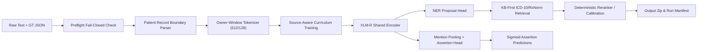

# Kiến Trúc Pipeline NLP Y Khoa

## Tổng Quan Kiến Trúc
Hệ thống xử lý văn bản y khoa dựa trên nguyên tắc **Contract-first, Resource-safe**, được thiết kế để chạy end-to-end trên Kaggle GPU (T4 16GB) mà không bị OOM hay mất mát offset văn bản gốc.

---

## 1. Luồng Dữ Liệu từ Raw Text đến Tensor
1. **Raw Source Invariant**: Văn bản thô (raw TXT) là chuẩn tuyệt đối cho character offset (`raw_text[start:end] == entity.text`). Không hạ chữ thường hay xóa dấu trực tiếp trên text gốc.
2. **Record Parser**: Chia văn bản thành các đợt khám/bệnh nhân (`ClinicalRecord`). Entity không được vượt biên record.
3. **Owner-Window Dataset**: Mọi gold entity được gán cho duy nhất 1 window chủ sở hữu (`TokenWindow`) với `max_length=512`, `stride=128`. Các window khác overlap entity sẽ có `loss_mask=False` để tránh học sai `O`.
4. **BIO Label Mapping**: Quản lý BIO labels với ignore index `-100` cho special tokens và non-owner tokens.

---

## 2. Luồng Huấn Luyện Curriculum (3 Stages)
- **Stage 1 (Synthetic Warm-up)**: Học biên thực thể trên 2.000 hồ sơ tổng hợp (`learning_rate=3e-5`, 3 epochs).
- **Stage 2 (Source-Aware Mixed Training)**: Trộn 35% organizer chunks với 65% synthetic chunks (`learning_rate=2e-5`, 2 epochs).
- **Stage 3 (Organizer Adaptation & Replay)**: Tinh chỉnh sâu với 80% organizer và 20% replay các mẫu khó/hiếm (`learning_rate=1e-5`, 4 epochs).
- **Final-Fit**: Huấn luyện NER encoder cập nhật cuối cùng, sau đó freeze encoder để train Assertion Head (`isNegated`, `isHistorical`, `isFamily`).

---

## 3. Luồng Suy Luận & Phôi Hợp (Inference Merge)
1. **NER Proposal**: Dự đoán các đoạn thực thể tiềm năng từ XLM-R NER.
2. **KB-First Recovery**: Quét alias chính xác từ từ điển ICD-10 và RxNorm để bắt các thực thể NER có thể bỏ sót.
3. **Record Merge**: Ghép proposal theo biên record, loại bỏ các proposal đè đè hoặc vi phạm round-trip substring.
4. **Assertion & Candidate Output**: Dự đoán 3 trục assertion bằng sigmoid và trả về tối đa 1 candidate duy nhất (hoặc rỗng nếu không chắc chắn).

---

## 4. Giải Thích ELI5 — Mô Hình Bệnh Viện
- **Lễ tân (Preflight & Resolver)**: Kiểm tra mã hồ sơ, đảm bảo không nhầm lẫn giấy tờ trước khi cho bệnh nhân vào khám.
- **Bác sĩ Chuyên khoa (XLM-R NER)**: Đọc từng đoạn bệnh án để tìm ra bệnh, thuốc, triệu chứng và kết quả xét nghiệm.
- **Y tá Xác minh (Assertion Head)**: Kiểm tra lại xem bệnh đó là bệnh nhân đang bị, phủ định ("không sốt") hay tiền sử người nhà.
- **Thủ thư Từ điển (KB Retrieval)**: Tra cứu mã ICD-10 cho bệnh và RxNorm cho thuốc từ tủ sách chuẩn y khoa.
