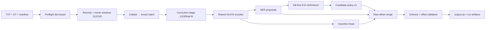

# Kiến trúc Pipeline NLP Y khoa

Pipeline dùng nguyên tắc **contract-first, resource-safe**. Raw text là nguồn
chuẩn cho offset; notebook chỉ gọi orchestrator, còn business logic nằm trong
`clinical_nlp_lab`.



## Luồng dữ liệu

1. **Preflight** kiểm tra UTF-8, cặp TXT/GT, manifest, fingerprint và quyền
   train. Quarantine không được tự động trở thành dữ liệu train.
2. **Record parser** chia document thành `ClinicalRecord`; entity không được
   vượt biên record.
3. **Owner-window** dùng `max_length=512`, `stride=128`. Mỗi entity chỉ có một
   owner window; window overlap nhưng không sở hữu entity sẽ mask loss.
4. **Collator** tạo `input_ids`, `attention_mask`, BIO labels, raw offsets,
   entity spans và assertion masks.
5. **Curriculum** ghi stage manifest cùng dataset/split/config/checkpoint hash.
   Resume bị từ chối nếu fingerprint không khớp.

## Luồng inference

NER và KB-first retrieval là hai nhánh recall độc lập. Proposal phải round-trip
đúng `raw_text[start:end]` và nằm trong một record trước khi merge. Assertion chỉ
áp dụng cho disease/drug/symptom; candidate policy giữ tối đa một candidate hoặc
abstain. Qwen nếu được bật chỉ là refinement tùy chọn; lỗi Qwen không làm mất
deterministic output.

## Orchestrator và ba chế độ

```text
full            → execute_run        → đủ 13 phase
resume          → resume_run         → tiếp tục sau LATEST.json
inference_only  → run_inference_only → preflight + inference + packaging
```

Mỗi phase ghi `PHASE_START` và đúng một event terminal trong `run.jsonl`. Artifact
được ghi vào file tạm, flush/fsync rồi atomic rename; `LATEST.json` chỉ cập nhật
sau publication thành công.

Notebook tự bind `build_kaggle_phase_runners(config)` vào dispatcher. Nếu một
runner lỗi hoặc bị thiếu, dispatcher dừng fail-closed và ghi
`artifacts/<phase>.error.json`; hệ thống không được tự ghi `PASS` giả.

Notebook mặc định clone source từ branch `codex/kaggle-end-to-end-pipeline`
trong setup cell; chỉ cần attach dataset dữ liệu và bật Internet. Có thể tắt
clone bằng `USE_GIT_CLONE=0` nếu dùng code Dataset đã mount.

Notebook có một code cell quan sát cho từng phase. Phase 07–10 gọi distributed
training subprocess trên T4×2; phase 11 fit assertion/candidate heads; phase 12
reload final bundle để inference; phase 13 đóng gói checkpoint và output.

## ELI5

Hệ thống giống một bệnh viện: preflight là lễ tân kiểm tra hồ sơ, owner-window là
chia bệnh án thành từng trang mà không đếm một bệnh nhân hai lần, XLM-R là bác sĩ
tìm bệnh/thuốc, assertion head là y tá xác định “không mắc” hay “tiền sử”, KB là
tủ từ điển mã chuẩn, còn orchestrator là điều phối viên ghi lại từng bước và chỉ
đóng gói kết quả sau khi mọi kiểm tra xong.

Local chỉ chạy contract test CPU; không train hoặc tải model. Người dùng thực
hiện `Save Version → Run All` trên Kaggle và gửi `run.jsonl`, `LATEST.json`,
`run_manifest.json` cùng traceback nếu có lỗi.
